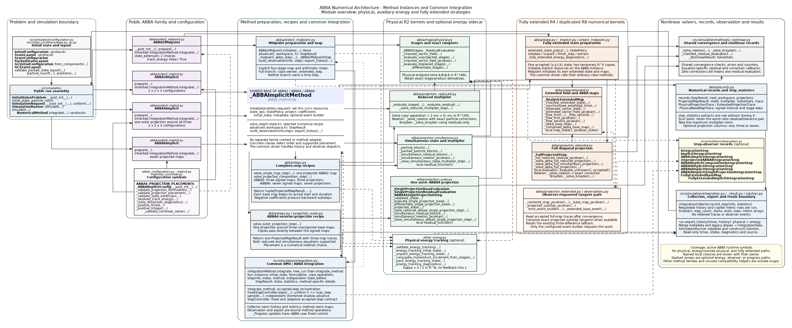

# Canonical ABBA numerical architecture

[Editable source](abba-numerical-architecture.puml) · [Scalable diagram (SVG)](abba-numerical-architecture.svg)



The implicit ABBA family now has one prepared execution path. ABBA2, ABBA4 and
ABBA6 share the coordinator, state operations, convergence drivers, numerical
records and observation adapters. Their step recipes retain the mathematical
distinction between composing projected maps and projecting a composition.

Read the current model diagrams horizontally for the complete lifecycle and
vertically for each phase's operations and records:

- [ABBA2 complete execution](../../abba2-implicit/simulation/abba2-implicit-simulation-architecture.puml)
  ([PNG](../../abba2-implicit/simulation/abba2-implicit-simulation-architecture.png)).
- [ABBA4 complete execution](../../abba4-implicit/simulation/abba4-implicit-simulation-architecture.puml)
  ([PNG](../../abba4-implicit/simulation/abba4-implicit-simulation-architecture.png)).
- [ABBA6 signed composition](../../abba6-implicit/simulation/abba6-implicit-simulation-architecture.md).
- [ABBA2 midpoint](../../abba2-midpoint/simulation/abba2-midpoint-simulation-architecture.md).

The family overview preserves its original module regions: problem boundary,
public configurations, preparation and integration, physical kernels, fully
extended kernels, and shared records/results. Its contents describe the current
prepared architecture. ABBA2 and ABBA4 retain their detailed six-phase lifecycle
diagrams; ABBA6 retains its signed-composition sequence diagram. The separate
`proposed-*` files remain historical design documents.

## Method instances and integration lifecycle

This method inherits `IntegrationMethod.integrate(problem, request)`, shared by
all 13 public methods. It calls `new_run(problem, request)` to create a fresh
instance of the same numerical class. That instance's `initialize` validates
capabilities and sets its formulation, initial internal state and metadata.
There is no separate context or callback-based method record.

| Operation on the numerical class | Responsibility |
|---|---|
| `initialize(problem, request)` | Initialize this run's resources once; return `None` |
| `advance(t, state, h)` | Execute numerical work and return state, statistics and typed details |
| `build_observation(info, step)` | Construct a method-specific event with independent snapshots |
| `export_history(times, history)` | Extract physical output and auxiliary diagnostics |
| `controller()` | Select fixed or adaptive accepted-step scheduling |

`integrate_method(run)` owns the common loop. Its `IntegrationCollector` saves
requested samples and copied accepted-step metric rows, without retaining
numerical details or events. The method owns the formulation and any live solver.
Analysis and persistence remain in `diagnostics/`; observers remain caller-owned.

Constructor options remain reusable through `simulate`. Per-run resources are
excluded from reconstruction, and initial state and metadata are isolated as
read-only copies. A completed or failed run cannot be integrated again; create a
fresh run. Call `new_run` for low-level access rather than resetting `initialize`.

`FixedStepController` calls `run.advance` with the exact effective duration and
uses independent shortened maps for interior output times. DOP853/Radau's
controller calls their ordinary `advance` on the live solver with an upper step
bound and reads the actual accepted endpoint. Dense sampling retains the backend.

Metric rows follow `step_times`; physical and auxiliary histories follow
`Solution.t`. Common fields are `step_count`, `step_start_times`, `step_times`,
`step_sizes` and `output_interpolation_count`. Shadow work and extra observer-only
work are excluded from accepted numerical counters.

See the [generic architecture](../../../simulation/integration-architecture.md)
for the lifecycle, adaptive semantics and extension guide. Executable contracts
are in `tests/test_method_integration.py` and `tests/test_adaptive_integration.py`.

## Reading the implementation

```text
simulate(problem, method, request)
  -> SimulationRunner
  -> method.integrate(problem, request)
  -> method.new_run(problem, request): same concrete ABBA class
       -> _ABBAImplicitMethod.initialize(problem, request)
  -> integrate_method(run)
       -> FixedStepController.steps -> run.advance(t, workspace, h)
            -> run.state_ops.unpack(t, workspace)
            -> run.solve_step(t, state, h)
            -> run.state_ops.finish_step(t, h, workspace, projections)
            -> StepResult -> metrics -> optional run.build_observation
       -> run.export_history(output_times, history)
       -> IntegrationData
  -> SimulationRunner validates and constructs Solution
```

Start at the public class's order and options, then read the inherited operations
in `_implicit.py`. The former `preparation.py`, `PreparedABBA` and `runtime.py`
adapter have been removed. Midpoint owns both state modes in `order2_midpoint.py`.
Projection equations and state policies remain shared mathematical components.

| File under `src/simulation/methods/abba/` | Responsibility |
|---|---|
| `order2_implicit.py`, `order4_implicit.py`, `order6_implicit.py` | Concrete order and supported placement |
| `_implicit.py` | Shared controls, initialization, step recipe, advance, observation and export |
| `_configuration.py` | Option validation and state-dimension metadata |
| `order2_midpoint.py` | Arithmetic-mean projection in physical and fully extended coordinates |
| `steps.py` | Numerical projection kernels and composition recipes |
| `state.py`, `_energy.py` | Workspace operations and physical/extended energy handling |
| `records.py` | Typed numerical traces and observer-independent statistics |
| `observations.py` | Optional adapters to the public event classes |
| `projection_reduced.py`, `projection_simultaneous.py` | Physical single-map projection equations |
| `projection_outer.py` | Physical equations around the complete ABBA4 composition |
| `projection_extended.py` | Full-diagonal equations and implicit tangents |
| `maps/physical.py`, `maps/extended.py` | Unprojected stages and exact derivatives |
| `../_nonlinear.py` | Solver controls, shared Newton and Broyden drivers |
| `../../integration.py` | Common method lifecycle, controller and collector |

The public `InitialValueProblem`, `SimulationRequest`, `simulate` and `Solution`
contracts are unchanged. Shared physical contracts are documented in
[the dynamics guide](../../../dynamics/gc2d-h5-import.md).

## Configuration and method identity

The four public classes define 39 normalized configurations:

| Method | State/energy strategies | Formulations | Solvers | Placements | Total |
|---|---:|---:|---:|---:|---:|
| `ABBA2Midpoint` | 3 | Arithmetic mean | None | One | 3 |
| `ABBA2Implicit` | 3 | 2 | 2 | One | 12 |
| `ABBA4Implicit` | 3 | 2 | 2 | One | 12 |
| `ABBA6Implicit` | 3 | 2 | 2 | One | 12 |

The three state/energy strategies are `(physical, False)`,
`(physical, True)` and `(fully_extended, True)`. Full extension always resolves
`track_energy` to `True`. Implicit formulations are `reduced_multiplier` and
`simultaneous_state_multiplier`; nonlinear solvers are `newton` and `broyden`.
ABBA4 defaults to one outer projection; tolerance option names remain intact.

| Recipe | Base maps per complete step | Accepted projections |
|---|---:|---:|
| ABBA2: `solve_single_map_step` | 1 | 1 |
| ABBA4: `solve_outer_projection_step` | 3 | 1 |
| ABBA6: `solve_projected_composition_step` | 7 | 7 |

ABBA4 uses `around_complete_composition` by default and as its only accepted
placement. `after_each_abba_map` raises an explicit error. Every signed map uses its actual
start time. Negative composition coefficients retain backward substeps.
One exterior projection encloses continuous duplicated copies through all
three base maps; it is a different numerical map from three projected solves.

## Method resources and numerical records

`_ABBAImplicitMethod` owns the initial state, projection equation, `StatePolicy`,
coefficients, optional event builder and numerical metadata. Its ordinary
`solve_step` selects the recipe for the concrete order. Initial state and
coefficient metadata are read-only copies. Initialization checks planar dynamics,
one-particle full extension, energy capabilities and Newton derivatives.

`StatePolicy` contains four callables:

1. `initialize(z0, t0)` builds the internal workspace.
2. `unpack(t, workspace)` exposes the numerical state.
3. `finish_step(t, h, workspace, projections)` closes state and energy.
4. `extract(times, history)` returns physical output and energy diagnostics.

For `N` physical particles, the numerical state has `2N` components. Optional
energy tracking appends `N` auxiliary momenta `kappa=k/2` to the workspace.
It uses accepted stage traces and never changes the physical solve. The full
branch evolves one `(x,y,t,k)` state, duplicates it into eight components,
and synchronizes time at outer boundaries and requested output times.

`ProjectedMapResult` describes exactly one accepted projection: input and output
states, signed interval, multiplier, `SolveStats` and a typed trace.
`PhysicalProjectionTrace` contains one or three `PhysicalBaseMapTrace` records.
`ExtendedProjectionTrace` retains the complete selected full base-map result
and coefficients; an exterior composition is still one projection record.
`StepResult` holds the next workspace and the ordered tuple of projections.

Internal arrays are numerical work data. Public `Solution` arrays and observer
snapshots are copied at their respective boundaries.

## Shared convergence, specialized mathematics

`_solve_newton` owns residual validation, convergence decisions, iteration
limits and counters. A formulation supplies its residual and update callback;
the callback owns analytic Jacobian assembly, particle packing and the exact
correction algebra. `_solve_broyden` retains its residual-only secant update.
The drivers return `_NonlinearResult`; the step adapters create `SolveStats`.
A converged initial guess takes zero corrections and one residual evaluation.

| State | Accepted numerical state | Base state | Reduced unknown | Simultaneous unknown |
|---|---:|---:|---:|---:|
| Physical, with or without tracking | `2N` | `4N` | `2N` | `6N` |
| Fully extended, one particle | 4 | 8 | 4 | 12 |

Newton derivatives remain exact and formulation-specific. Broyden does not
request analytic derivatives during its nonlinear iterations. Optional full
observation may evaluate tangents after convergence, with the existing finite
difference fallback when analytic derivatives are unavailable.

## Sampling, diagnostics and observers

The existing fixed-grid scheduler controls time. Main steps advance the
accepted trajectory and append metrics. An off-grid requested sample uses an
independent advance from the preceding main node. It uses the same numerical
recipe and error checks, without changing main states, metrics or events.

`step_statistics` sums corrections/evaluations, selects residual and tolerance
from the same worst normalized solve, and extracts the maximum multiplier norm.
`IntegrationCollector` stacks its accepted metric rows without constructing events. Substep columns count projections, so outer ABBA4 has one
column even though its trace contains three base maps.

`observations.py` constructs copied method-specific events only when an
observer is installed and the scheduler accepts a main step. Current physical
ABBA2, composed ABBA6, exterior ABBA4 and fully extended events are emitted.
The old ABBA4 event type remains available for historical diagnostic data. Shadow steps emit none.

Diagnostic keys remain compatible with the retained outer-projection
implementation, including optional energy histories. ABBA4 has one projection
column, replacing the three columns of its retired default. The legacy `newton_*` metric aliases are applied at the final
`IntegrationData` boundary. Study result labels such as
`ABBA4ImplicitSingleProjection` and persisted CSV fields stay unchanged.

## Midpoint and compatibility

`ABBA2Midpoint` uses arithmetic projection and the same `integrate_method` coordinator.
It shares `maps/physical.py`, `maps/extended.py` and energy helpers. Its full-state
initialization and advance live directly in `order2_midpoint.py`. The former
private midpoint coordinator has been removed.

The old private map/projection modules and `methods/_fully_extended.py` retain
compatibility imports. `composition.py` adapts the old private composition
ABBA6 entry point to the shared recipe. The former ABBA4 three-projection
solver is removed; the private ABBA4 spelling delegates to the outer solver.
`ABBA4ImplicitSingleProjection(...)` remains a deprecated factory for
`ABBA4Implicit(projection_placement="around_complete_composition", ...)`.
New internal code uses the canonical modules listed above. The configuration
comparison now executes eight energy-enabled combinations. Study keys explicitly
naming single projection are preserved, so saved three-projection measurements
are not silently reinterpreted. The retired projection-comparison runner raises
before performing work; its saved results and plot APIs remain available.

## Earlier ABBA recipe refactor validation

Before changing numerical code, 96 short reference runs covered ABBA2, both
ABBA4 placements and ABBA6, both formulations, Newton/Broyden, all state/energy
strategies, observers and off-grid samples. After the refactor, trajectory
arrays, diagnostics, event data, event map evaluations and full tangents
matched those references exactly.

`tests/test_abba_shared_runtime.py` checks record cardinality, shadow-sample
isolation, observer independence and the common Newton driver's counters and
failure limit. Existing model, full-state and Broyden tests cover the numerical
contracts. Development notebook API validation executes selected cells with
two-step studies and temporary outputs; canonical studies are not run in full.

The completed validation passed 114 focused tests: 101 ABBA tests, four
full-state tests, and nine Broyden/package-layout tests. Syntax checks passed
for all 20 development notebooks (167 code cells). The three notebooks that
use the affected APIs passed selected-cell checks, including short study calls,
diagnostic assertions, temporary CSV persistence and representative plots.
Their original scientific parameters, saved outputs, logs and CSV remain intact.

Type checking passed for all 32 files in the changed-module check. The global
check still reports 19 existing errors in five unchanged diagnostics, studies
and visualization files; those files match the pre-refactor Git revision.
