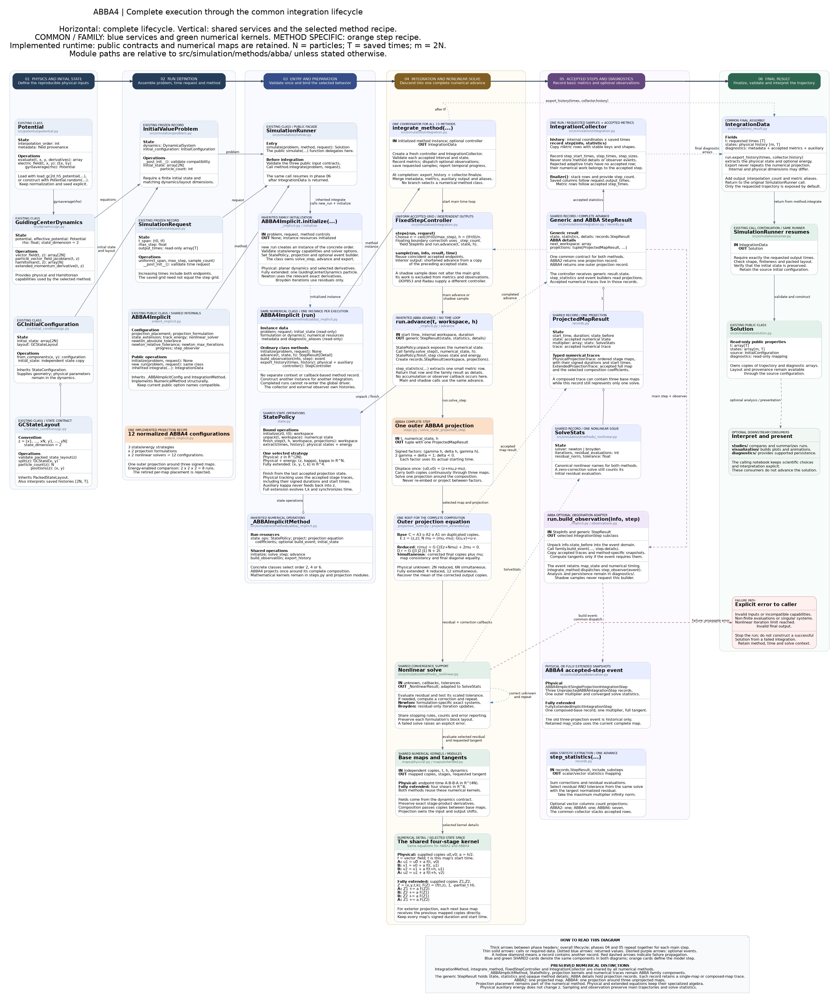

# ABBA4 implicit: one outer projection

[Editable diagram](abba4-implicit-simulation-architecture.puml) · [Scalable diagram](abba4-implicit-simulation-architecture.svg)



`ABBA4Implicit()` uses the single outer-projection algorithm formerly selected
explicitly through `order4_implicit_single_projection.py`. That module now provides
compatibility imports; the numerical equations live in `projection_outer.py`.
The three signed ABBA maps evolve both copies continuously, and one symmetric
Hairer projection encloses the whole composition. The implementation that
projected each factor independently has been removed.

```python
from simulation import ABBA4Implicit, SimulationRequest, simulate

solution = simulate(problem, ABBA4Implicit(), SimulationRequest.uniform())
assert solution.diagnostics["nonlinear_solves_per_step"] == 1
assert solution.diagnostics["unprojected_abba_maps_per_step"] == 3
```

The explicit value `projection_placement="around_complete_composition"` and
the deprecated `ABBA4ImplicitSingleProjection(...)` factory select this same
implementation. `projection_placement="after_each_abba_map"` raises an error.

## Method instances and integration lifecycle

This method inherits `IntegrationMethod.integrate(problem, request)`, shared by
all 13 public methods. It calls `new_run(problem, request)` to create a fresh
instance of the same numerical class. That instance's `initialize` validates
capabilities and sets its formulation, initial internal state and metadata.
There is no separate context or callback-based method record.

| Operation on the numerical class | Responsibility |
|---|---|
| `initialize(problem, request)` | Initialize this run's resources once; return `None` |
| `advance(t, state, h)` | Execute numerical work and return state, statistics and typed details |
| `build_observation(info, step)` | Construct a method-specific event with independent snapshots |
| `export_history(times, history)` | Extract physical output and auxiliary diagnostics |
| `controller()` | Select fixed or adaptive accepted-step scheduling |

`integrate_method(run)` owns the common loop. Its `IntegrationCollector` saves
requested samples and copied accepted-step metric rows, without retaining
numerical details or events. The method owns the formulation and any live solver.
Analysis and persistence remain in `diagnostics/`; observers remain caller-owned.

Constructor options remain reusable through `simulate`. Per-run resources are
excluded from reconstruction, and initial state and metadata are isolated as
read-only copies. A completed or failed run cannot be integrated again; create a
fresh run. Call `new_run` for low-level access rather than resetting `initialize`.

`FixedStepController` calls `run.advance` with the exact effective duration and
uses independent shortened maps for interior output times. DOP853/Radau's
controller calls their ordinary `advance` on the live solver with an upper step
bound and reads the actual accepted endpoint. Dense sampling retains the backend.

Metric rows follow `step_times`; physical and auxiliary histories follow
`Solution.t`. Common fields are `step_count`, `step_start_times`, `step_times`,
`step_sizes` and `output_interpolation_count`. Shadow work and extra observer-only
work are excluded from accepted numerical counters.

See the [generic architecture](../../../simulation/integration-architecture.md)
for the lifecycle, adaptive semantics and extension guide. Executable contracts
are in `tests/test_method_integration.py` and `tests/test_adaptive_integration.py`.

## Numerical step

Let `A_(q,t)` denote an unprojected endpoint-time ABBA map, and define

\[
\gamma=\frac{1}{2-\sqrt[3]{2}},\qquad
\delta=-\frac{\sqrt[3]{2}}{2-\sqrt[3]{2}}.
\]

The complete duplicated map is

\[
C_{h,t}=A_{\gamma h,t+(\gamma+\delta)h}
\circ A_{\delta h,t+\gamma h}\circ A_{\gamma h,t}.
\]

Thus `2*gamma+delta=1` and `2*gamma**3+delta**3=0`. The middle factor has a
negative duration; every factor uses its actual start time. There is no
intermediate return to the diagonal.

With `E z=(z,z)`, `N mu=(mu,-mu)`, `G(u,v)=u-v` and `P(u,v)=(u+v)/2`, the
reduced projection solves

\[
r(\mu)=G C_{h,t}(Ez+N\mu)+2\mu=0,\qquad
z^+=P\big(C_{h,t}(Ez+N\mu)+N\mu\big).
\]

Every residual evaluation traverses all three factors. Newton uses
`D_mu r = G (J3 @ J2 @ J1) N + 2I`; Broyden solves the same equation with
secant updates. The simultaneous formulation includes corrected output copies
and the multiplier in one system; eliminating its output variables recovers
the same reduced equation. Its solver is selected during preparation.

The ideal-root physical tangent is `P J_C (E - N K^-1 L)`, where
`K = G J_C N + 2I` and `L = G J_C E`. This is one implicit differentiation of the
complete base composition, rather than a product of three projected tangents.
Both public ABBA4 tangent helpers dispatch correctly for the current event.
Finite nonlinear tolerances perturb the ideal-root order and geometric claims.

## Preparation, state and observations

`ABBA4Implicit` selects order four and inherits `_ABBAImplicitMethod` operations.
`initialize` sets the projection solver, `StatePolicy` and optional event adapter
on the run instance. `solve_step` chooses `solve_outer_projection_step`;
`advance` returns the complete accepted state and statistics. The collector owns
trajectory history.

| State/energy strategy | Accepted numerical state | Duplicated base | Reduced unknown | Simultaneous unknown |
|---|---:|---:|---:|---:|
| Physical, tracking off | `2N` | `4N` | `2N` | `6N` |
| Physical, tracking on | `2N` plus `N` auxiliary momenta | `4N` | `2N` | `6N` |
| Fully extended, one particle | 4 | 8 | 4 | 12 |

Physical energy tracking reuses accepted stage traces for `kappa=k/2` without
changing the physical root. Fully extended execution evolves `(x,y,t,k)` and
always enables energy. The three strategies, two formulations and two solvers
give **12 configurations**; the comparison with energy enabled has **8**.

Each complete step returns one `ProjectedMapResult` with a trace of three
unprojected factors. Physical observations use
`ABBA4ImplicitSingleProjectionIntegrationStep`, with a single multiplier and
three `UnprojectedABBAIntegrationStep` records. Fully extended observations use
`FullyExtendedImplicitIntegrationStep`, with one composed-base record and its
full tangent. Retained `map_state` callbacks reproduce the same fixed-time,
fixed-duration map on independent candidate states.

`nonlinear_solves_per_step` and `implicit_substeps_per_step` are 1; substep
metric arrays have shape `(accepted_steps, 1)`. `unprojected_abba_maps_per_step`
and `unprojected_abba_maps_per_residual_evaluation` are 3. These quantities
count different objects and must not be interchanged.

## Compatibility and historical results

The old event class and diagnostic readers remain available for historical
data. They do not provide a runnable three-projection numerical method.
`run_abba4_projection_comparison_study` now rejects new executions, because its
scientific comparison requires the removed implementation. Current refinement
uses `run_abba4_implicit_accuracy_study`; configuration comparisons execute only
the eight energy-enabled outer-projection combinations. Existing persisted
single-projection keys retain their identities.

## Related sources

- [Canonical theory](../tex/theory.tex) and [compiled theory](../tex/theory.pdf).
- [Public method](../../../../src/simulation/methods/abba/order4_implicit.py).
- [Outer projection](../../../../src/simulation/methods/abba/projection_outer.py).
- [Shared ABBA numerical class](../../../../src/simulation/methods/abba/_implicit.py).
- [Accepted observations](../../../../src/simulation/methods/abba/observations.py).
- [Family guide](../../abba/simulation/abba-numerical-architecture.md).

Earlier `proposed` diagrams and per-map companion derivations are historical;
the six-phase diagram above and `tex/theory.tex` describe the implemented method.
