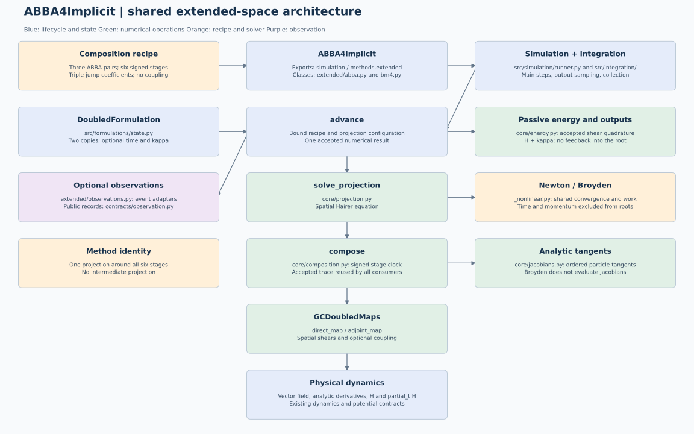

# ABBA4Implicit: shared extended-space execution

Three ABBA pairs; six signed stages; Triple-jump coefficients; no coupling. One projection around all six stages; No intermediate projection.

The numerical implementation now lives in `src/methods/extended/`.
Public method names and exports from `simulation` remain unchanged. ABBA6
now uses one outer projection; its observer substeps are unprojected pairs and
its nonlinear-work arrays have one column per accepted step. The former `methods/abba/` and
`methods/bm4/` import adapters have been removed. Internal imports point directly
to the defining modules in `methods.extended`.

See the [shared architecture](../../extended/simulation/extended-simulation-architecture.md)
for the module responsibilities, state layouts, solver equations, energy
normalization and validation contracts. The model's mathematical entry point
remains [theory.tex](../tex/theory.tex), with its compiled
[theory.pdf](../tex/theory.pdf).

## Numerical path

Initialization binds this model's recipe and options. The ordinary implicit
path is `advance -> solve_projection -> compose -> direct_map / adjoint_map`.
Explicit midpoint methods use `midpoint_step` in place of the nonlinear
projection. ABBA4 and ABBA6 both project once around the complete
unprojected composition; their recipes contain six and fourteen stages.

The reduced and simultaneous formulations use the same shared spatial
projection engine. Newton uses exact particle-block Jacobians and Broyden uses
residual-only secant updates.

The shared composition keeps signed durations and the nonautonomous stage
clock: adjoint maps evaluate at the start of their substep and direct maps at
its end. ABBA uses no harmonic coupling. BM4 retains its configurable coupling
and the existing defaults for each public class.

## Accepted states and diagnostics

For N planar particles, both methods use two spatial copies with 4N components.
Optional passive energy adds N time entries and N physical momenta, producing
6N accepted internal components. Physical outputs and observer snapshots remain
2N dimensional. Time and momentum never enter a nonlinear root.

The accepted shear trace feeds common normalized momentum quadrature after the
spatial computation. The diagnostic `H + kappa - H_initial` measures energy
balance for the time-dependent Hamiltonian. Tracking does not alter the spatial
map or its nonlinear stopping scale. Analytic tangents and BM4 stage events reuse
the retained spatial stages; no extra spatial replay is required for them.

The integration coordinator still owns accepted intervals, off-grid output
sampling, history collection and observer dispatch. Energy arrays follow saved
times and nonlinear-work arrays follow accepted main steps. Existing method
and observer tests remain applicable, supplemented by
`tests/test_extended_family.py`.

## Diagram maintenance

Regenerate this diagram and the shared family view with
`python scripts/render_extended_architecture.py`. The script writes the
PlantUML/Graphviz source and corresponding SVG/PNG views from the same graph
specification. Historical files marked `old` or `proposed` are archival diagrams;
the figure above describes the current implementation.

## Optional JAX execution

This model supports `simulate(..., options=ExecutionOptions(backend="jax", device="cpu"))`
(or a configured `device="gpu"`) with explicit float64. The complete fixed time
loop, particle stages, applicable nonlinear/projection solves and passive energy
quadrature remain on that device until final NumPy `Solution` export. Its
coefficients, physical-state tolerance scaling and sampling conventions are
unchanged. JAX rejects unconverged solves explicitly. Diagnostics report
`execution_mode="device_resident"`. Python step observers and progress reporting
require the default CPU path.

Import `ExecutionOptions` from `contracts.execution_options`. Omission preserves existing
SciPy/NumPy execution. See the [shared execution contract](../../../simulation/jax-execution.md)
for supported physical systems, solver details, timing scope and validation.

## Complete integration executor

`simulate(problem, method, request, execution=Execution())` delegates the complete
integration to `Execution.run`. Import the executor with `from execution import
Execution`. It uses the existing local method implementation and does not
configure runtime resources. A subclass can replace the whole integration while
`simulate` retains final `Solution` construction and validation. Backend choices
remain separate in `options=ExecutionOptions(...)`. See the
[executor contract](../../../simulation/execution.md) for the extension interface.
The numerical stages, projection equations and integration controllers described
above remain inside this execution boundary.

`Execution_Modal` now implements this boundary for remote NumPy/SciPy CPU
integrations. Results return to the local machine for validation and subsequent
persistence; see the [Modal executor guide](../../../simulation/modal-execution.md).

## Initial-state ownership

`InitialValueProblem` captures the validated physical state, particle count, and
independent layout at construction. A later edit to the original initial-state
provider does not change this run's formulation. Physical layouts are owned by
`contracts.state_layout`; compatible external providers need no inheritance from
initial-condition classes. Built-in dynamics keep their physical parameters
immutable. See the shared [layout and ownership contract](../../../dynamics/protocols.md#physical-layouts-and-problem-ownership).

## Newton iterate callbacks

The keyword-only `newton_observer` receives independent read-only
`contracts.nonlinear.NewtonIteration` snapshots, including the physical
projection multiplier. It observes already computed residuals and supports
independent or nested runs without global instrumentation. Direct advances and
off-grid output solves emit iterates; diagnostic `map_state` replay does not.
Broyden, compiled JAX, and remote Modal execution reject this optional Python
callback. See the [shared callback and particle-solve contract](../../extended/simulation/extended-simulation-architecture.md#explicit-newton-iteration-observation).

### Shared comparison records

The three-, four-, and five-method comparison campaigns share method construction,
alignment checks, and metric reductions in `studies._comparison`; their public
study entry points remain unchanged. Reference, accuracy, summary, and execution
records belong to `contracts.comparison`, and CSV readers reconstruct those same
record types without importing study orchestration. Energy-bound and parallel
BM4 archive records belong to `contracts.study_results`, with explicit re-exports
from their established study modules. See the
[record ownership contract](../../../simulation/integration-architecture.md#comparison-and-archive-record-ownership).

## Compiled fixed-step contract

Fixed-step methods inherit `CompiledFixedMethod` and provide a JAX adapter that
returns `contracts.compiled.CompiledStep`. The shared `integration/jax_fixed.py`
loop knows no concrete numerical method; each method owns its compiled stages
and statistics. See [JAX execution](../../../simulation/jax-execution.md).

## Potential evaluation boundary

`Potential.evaluate` uses NumPy/SciPy; `JaxPotential` inherits its representation
and overrides only `evaluate` with JAX. Simulation preparation binds the shared
GC/FC equations to JAX potentials sharing the existing splines, including the
gyroaveraged field, without refitting or mutating the source dynamics. Inherited
electric fields follow the potential class; `evaluate_grid` remains NumPy-only. See the
[shared potential contract](../../../dynamics/jax-potential-evaluation.md).
