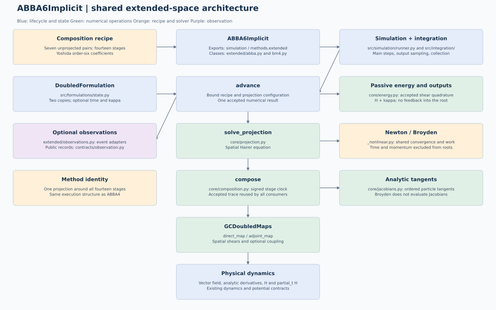

# ABBA6Implicit: shared extended-space execution

Seven continuous, signed ABBA pairs with Yoshida order-six coefficients. One
outer projection around all fourteen direct/adjoint stages, exactly the same
execution structure as ABBA4.

The numerical implementation now lives in `src/methods/extended/`.
Public method names and exports from `simulation` remain unchanged. ABBA6
now uses one outer projection; its observer substeps are unprojected pairs and
its nonlinear-work arrays have one column per accepted step. The former `methods/abba/` and
`methods/bm4/` import adapters have been removed. Internal imports point directly
to the defining modules in `methods.extended`.

See the [shared architecture](../../extended/simulation/extended-simulation-architecture.md)
for the module responsibilities, state layouts, solver equations, energy
normalization and validation contracts. The model's mathematical entry point
remains [theory.tex](../tex/theory.tex), with its compiled
[theory.pdf](../tex/theory.pdf).

## Numerical path

Initialization binds this model's recipe and options. The ordinary implicit
path is `advance -> solve_projection -> compose -> direct_map / adjoint_map`.
Explicit midpoint methods use `midpoint_step` in place of the nonlinear
projection. ABBA4 and ABBA6 both project once around the complete
unprojected composition; their recipes contain six and fourteen stages.

The reduced and simultaneous formulations use the same shared spatial
projection engine. Newton uses exact particle-block Jacobians and Broyden uses
residual-only secant updates.

The shared composition keeps signed durations and the nonautonomous stage
clock: adjoint maps evaluate at the start of their substep and direct maps at
its end. ABBA uses no harmonic coupling. BM4 retains its configurable coupling
and the existing defaults for each public class.

## Accepted states and diagnostics

For N planar particles, both methods use two spatial copies with 4N components.
Optional passive energy adds N time entries and N physical momenta, producing
6N accepted internal components. Physical outputs and observer snapshots remain
2N dimensional. Time and momentum never enter a nonlinear root.

The accepted shear trace feeds common normalized momentum quadrature after the
spatial computation. The diagnostic `H + kappa - H_initial` measures energy
balance for the time-dependent Hamiltonian. Tracking does not alter the spatial
map or its nonlinear stopping scale. Analytic tangents and BM4 stage events reuse
the retained spatial stages; no extra spatial replay is required for them.

The integration coordinator still owns accepted intervals, off-grid output
sampling, history collection and observer dispatch. Energy arrays follow saved
times and nonlinear-work arrays follow accepted main steps. Existing method
and observer tests remain applicable, supplemented by
`tests/test_extended_family.py`.

## Diagram maintenance

Regenerate this diagram and the shared family view with
`python scripts/render_extended_architecture.py`. The script writes the
PlantUML/Graphviz source and corresponding SVG/PNG views from the same graph
specification. Historical files marked `old` or `proposed` are archival diagrams;
the figure above describes the current implementation.
