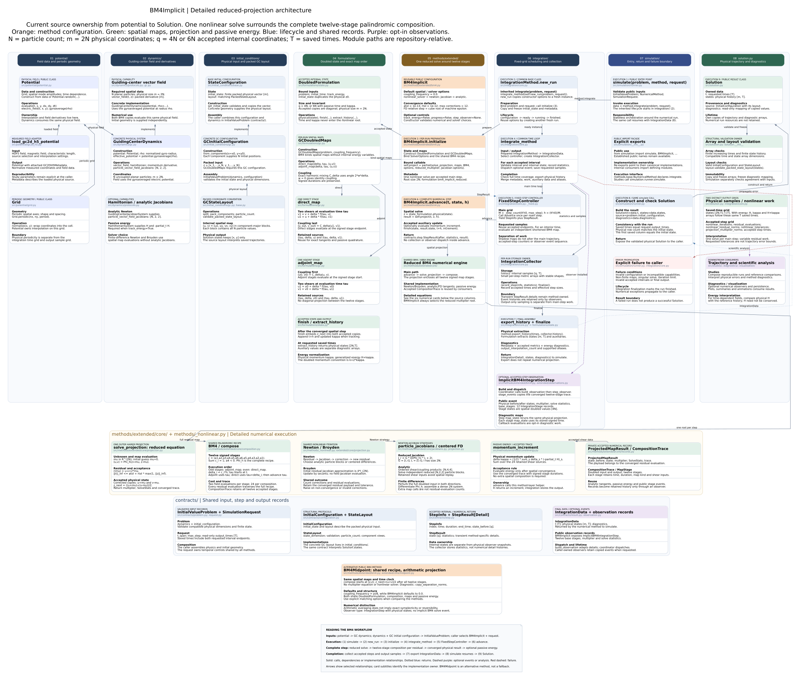

# BM4: detailed execution architecture



Open the [SVG](bm4-detailed-architecture.svg) with zoom, the
[PNG](bm4-detailed-architecture.png), or the canonical
[PlantUML/Graphviz source](bm4-detailed-architecture.puml).
This additional diagram follows the style and package ownership of the
[detailed project architecture](../../../simulation/package-integration-architecture.md).
The existing [compact BM4 diagram](bm4-simulation-architecture.md) and historical
diagrams remain available.

The main path describes `BM4Implicit`. The final comparison card describes
`BM4Midpoint` as a separate public method with shared numerical components.
Numbered execution cards follow the actual calls; the eight source columns
describe implementation ownership. The numerical band expands the projection,
composition, nonlinear solve, derivatives, passive energy and accepted records.

## One complete implicit step

For `N` guiding-center particles, let `z` be the packed physical state of size
`m = 2N`. The shared `DoubledFormulation` stores two identical accepted spatial
copies, plus one time and one physical momentum per particle when tracking
energy. Its accepted internal size is therefore `4N` or `6N`.

`BM4Implicit.initialize` binds `GCDoubledMaps`, the `BM4` composition recipe,
`SolverOptions`, and the reduced `solve_projection` callable. The inherited
`IntegrationMethod.new_run` owns the fresh run instance and its frozen initial
state and metadata.

Each `advance` extracts the physical state and solves one multiplier equation:

```text
mu starts at zero and has size 2N.
(u, v) = Phi_h(z + mu, z - mu)
r(mu) = u - v + 2*mu
||r(mu)||_inf <= atol + rtol * max(1, ||z||_inf)
z_next = ((u + mu) + (v - mu)) / 2
```

`Phi_h` is the complete twelve-stage composition. Each residual evaluation
traverses all twelve stages; there are no intermediate diagonal projections.
The converged result contains the physical output, multiplier, solver statistics
and the exact trace associated with that accepted residual.

## Composition and solver choices

The signed weights are `(a1,a2,a3,a4,a5,a6,a6,a5,a4,a3,a2,a1)`, with `a4 < 0`.
Their canonical values live in `methods/extended/core/composition.py`.
Stages alternate adjoint then direct. For duration `delta`, the adjoint map uses
the stage start time and the direct map its signed endpoint; the stage clock
then advances by `delta`.

The direct map updates the second copy, updates the first using that new second
copy, and applies harmonic coupling. The adjoint map applies coupling first,
then updates the first and second copies in the reversed shear order. Both
retain two physical shear sources. A complete composition therefore makes
24 vector-field evaluations, before any additional nonlinear iterations or
finite-difference work.

Newton and Broyden solve the same reduced residual:

- Analytic Newton propagates ordered `4 x 4` particle tangents through the
  shears and coupling, then solves independent reduced `2 x 2` particle systems.
- Finite-difference Newton differentiates the full doubled spatial map and
  assembles a dense `2N x 2N` reduced system. Those extra spatial map evaluations
  are separate from the recorded residual-evaluation count.
- Broyden starts from `4I` and updates the residual Jacobian approximation by
  secants. It does not evaluate analytic field Jacobians.

The reduced Jacobian is `G D(Phi_h) L + 2I`, where `G = [I,-I]`,
`L = [I;-I]`, and `I` has size `2N`. Solver statistics retain the tolerance used
for acceptance, correction count, residual-evaluation count and final norm.

## Energy, observations and output

After convergence, optional passive quadrature sums the 24 retained signed
shear contributions and divides by two to recover physical `kappa` from the
doubled momentum convention. Energy tracking neither enters the spatial root
nor changes its stopping scale. The state formulation embeds the accepted
physical result into both copies and appends the new time and momentum.

`FixedStepController` owns the main grid. Interior output samples use independent
shortened BM4 maps, which do not change main-step statistics or events.
`integrate_method` collects results and dispatches an observer only when one is
installed. `ImplicitBM4IntegrationStep` contains the multiplier, physical
before/after states and twelve copied base stages. The base-stage states have
`4N` spatial components; the step snapshots have `2N` physical components.
Constructing these events reuses the accepted trace. Calling their diagnostic
`map_state` functions explicitly performs additional numerical evaluations.

History export produces physical samples `[2N, T]` and saved-time energy arrays.
Nonlinear-work arrays follow accepted main steps. The public `simulate` function
constructs `Solution` and verifies its saved times and initial state.

## BM4Midpoint comparison

| Property | BM4Implicit | BM4Midpoint |
|---|---|---|
| Spatial recipe | Twelve signed stages | Same recipe |
| Projection | Reduced Hairer equation | One arithmetic mean after the recipe |
| Nonlinear unknown | `2N` multiplier entries | None |
| Default coupling frequency | `0.0` | `pi/8` |
| Additional step metric | Multiplier norm and solve work | Copy-separation norm |
| Observer event | `ImplicitBM4IntegrationStep` | `IntegrationStep` |

Both methods share the state formulation, stage maps, composition and passive
energy implementation. Set matching coupling values explicitly in comparisons.
Arithmetic averaging alone does not imply exact symplecticity or reversibility.
The model's canonical mathematical reference remains
[theory.tex](../tex/theory.tex) and its [compiled PDF](../tex/theory.pdf).

## Regeneration

Edit `bm4-detailed-architecture.puml`. With Node.js, `@viz-js/viz` and `sharp`
available through normal module resolution or `NODE_PATH`, run from the
repository root:

```bash
node scripts/render_detailed_architecture.cjs docs/models/bm4-implicit/simulation/bm4-detailed-architecture.puml
```

The renderer writes only the matching SVG and PNG. The earlier BM4 and project
diagrams retain their independent sources and renderings.
