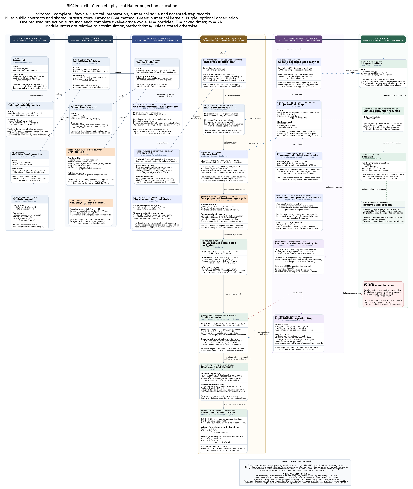

# BM4Implicit physical simulation architecture



Read the six numbered phases from left to right, then follow each column down:
physical inputs, run definition, preparation, integration, accepted-step records,
and the final result. The layout follows the ABBA4 architecture diagram while
showing BM4's implemented components and reduced Hairer solve. The previous
diagram is preserved as [the old source](bm4-simulation-architecture-old.puml)
and [the old rendering](bm4-simulation-architecture-old.png).

## Scope

`BM4Implicit` has one fixed geometric construction. The separate
[`BM4Midpoint`](../../bm4-midpoint/simulation/bm4-midpoint-simulation-architecture.md)
method shares its twelve-stage base cycle and uses arithmetic projection.

For a source-order explanation of every implementation symbol, array layout,
nonlinear branch, observer closure, and diagnostic field, see the
[`BM4Implicit` implementation walkthrough](bm4-implicit-code-walkthrough.md).

| Architectural choice | Fixed BM4 behavior |
|---|---|
| Public method | `BM4Implicit` |
| Accepted and returned state | Physical guiding-centre state `z in R^(2p)` for `p` particles |
| Internal splitting state | Two physical copies in `R^(4p)` |
| Projection | Hairer's symmetric projection |
| Projection placement | Once around one complete twelve-stage BM4 cycle |
| Nonlinear formulation | Reduced multiplier `mu in R^(2p)` |

Newton and Broyden are solver choices for the same reduced equation. They do
not define different numerical methods. Likewise, selecting an analytic or
finite-difference Newton Jacobian changes how the equation is solved, not the
projected map.

"Implicit" refers to the reduced multiplier root solve. The twelve
direct/adjoint maps in the BM4 base cycle are explicit sequential stages.

`BM4Implicit` has no stage-projected, arithmetic-midpoint, simultaneous-output,
or fully extended branch. Its accepted state never includes time or
its conjugate momentum. The duplicated `R^(4p)` value is only internal
splitting and nonlinear-solver workspace; it is not a fully extended state.

## Runtime boundaries

| File | Responsibility |
|---|---|
| [`src/simulation/methods/bm4/implicit.py`](../../../../src/simulation/methods/bm4/implicit.py) | Public configuration, reduced Hairer solve, BM4 map Jacobian, integration coordinator, diagnostics |
| [`src/simulation/methods/bm4/_core.py`](../../../../src/simulation/methods/bm4/_core.py) | Palindromic coefficients and ordered twelve-stage direct--adjoint composition |
| [`src/simulation/formulations/gc.py`](../../../../src/simulation/formulations/gc.py) | Preparation of the coupled two-copy physical GC maps |
| [`src/simulation/methods/_nonlinear.py`](../../../../src/simulation/methods/_nonlinear.py) | Solver validation and good-Broyden implementation |
| [`src/simulation/_fixed.py`](../../../../src/simulation/_fixed.py) | Main-grid and output-only shadow-step scheduling |
| [`src/simulation/observation.py`](../../../../src/simulation/observation.py) | `ImplicitBM4IntegrationStep` observer record |
| [`src/simulation/_result.py`](../../../../src/simulation/_result.py) | Internal `IntegrationData` result |
| [`src/simulation/solution.py`](../../../../src/simulation/solution.py) | Immutable public physical solution |

Preparation requires a guiding-centre initial configuration. The analytic
Jacobian path additionally requires the exact particle Jacobians supplied by
`GuidingCenterDynamics` and an effective potential with
`interpolation_order >= 3` whenever Newton needs a correction; finite-difference
Newton and Broyden evaluate the same prepared physical BM4 map without changing
its state contract.

## Public configuration

`BM4Implicit` exposes numerical-solution controls only:

| Field | Meaning | Default |
|---|---|---|
| `coupling_frequency` | Harmonic coupling frequency of the duplicated GC map; zero disables mixing while retaining the reduced Hairer projection | `0.0` |
| `newton_absolute_tolerance` | Absolute nonlinear stopping tolerance | `1e-13` |
| `newton_relative_tolerance` | State-scaled relative stopping tolerance | `1e-12` |
| `newton_max_iterations` | Maximum nonlinear corrections | `12` |
| `newton_jacobian_relative_step` | Relative centered-difference increment | `cbrt(machine epsilon)` |
| `newton_jacobian_method` | `"analytic"` or `"finite_difference"` | `"analytic"` |
| `nonlinear_solver` | `"newton"` or `"broyden"` | `"newton"` |
| `progress` | Enables fixed-grid progress output | `False` |
| `step_observer` | Optional accepted-step observer | `None` |

There is deliberately no projection-placement, projection-formulation,
state-extension, or energy-tracking selector.

## Complete BM4 base cycle

The six independent half-cycle coefficients are

\[
\begin{aligned}
a_1&= 0.0792036964311957,&
a_2&= 0.1303114101821663,\\
a_3&= 0.2228614958676077,&
a_4&=-0.3667132690474257,\\
a_5&= 0.3246481886897062,&
a_6&= 0.1096884778767498.
\end{aligned}
\]

They satisfy `sum(a_1, ..., a_6) = 1/2`. One complete step uses

\[
(b_1,\ldots,b_{12})=
(a_1,a_2,a_3,a_4,a_5,a_6,a_6,a_5,a_4,a_3,a_2,a_1)
\]

and executes

```text
adjoint(b1 h), direct(b2 h), ..., adjoint(b11 h), direct(b12 h)
```

The negative coefficient `a_4` is an intentional backward subflow. After each
stage, the composition clock advances by its signed duration. An adjoint stage
evaluates at the current clock; a direct stage evaluates at the clock plus its
signed duration. The twelve coefficients advance the clock by one complete
step.

No projection is applied between these stages. For a first-order map and its
exact adjoint, the palindromic composition is symmetric and has designed global
order four.

## Physical Hairer projection

Let `p` be the particle count, let the packed physical GC state have dimension
`m=2p`, and define

\[
E=\begin{pmatrix}I\\I\end{pmatrix},\qquad
P=\frac12\begin{pmatrix}I&I\end{pmatrix},\qquad
G=\begin{pmatrix}I&-I\end{pmatrix},\qquad
N=G^T.
\]

For one accepted state `z_n`, a trial multiplier displaces the two physical
copies before the complete BM4 cycle:

\[
\widehat Y_n=Ez_n+N\mu
=\begin{pmatrix}z_n+\mu\\z_n-\mu\end{pmatrix},
\qquad
M(\mu)=\Psi_{h,t_n}(\widehat Y_n).
\]

The same normal correction is applied to the complete-cycle output. Enforcing
the diagonal constraint gives the reduced equation

\[
r(\mu)=G\bigl(M(\mu)+N\mu\bigr)
=GM(\mu)+2\mu=0.
\]

After convergence,

\[
Y_{n+1}=M(\mu)+N\mu,\qquad
z_{n+1}=P Y_{n+1}.
\]

Thus "projection after the complete BM4 cycle" means one symmetric Hairer
projection surrounding that cycle: the converged multiplier appears in both
the input displacement and the output correction. It is not an arithmetic
post-processing projection.

## Nonlinear solve and Jacobian

If

\[
J_{\mathrm{BM4}}=D\Psi_{h,t_n}(Ez_n+N\mu),
\]

the reduced Newton matrix is

\[
D_\mu r=GJ_{\mathrm{BM4}}N+2I.
\]

With `newton_jacobian_method="analytic"`, the implementation accumulates the
ordered product of all twelve exact GC stage Jacobians. The
`"finite_difference"` path differentiates the complete duplicated map with
centered differences. Good Broyden instead updates an approximation to this
reduced residual Jacobian from `4I` and secant data; it never differentiates the
map or consults either Newton-Jacobian configuration field.

The stopping threshold for a state `z_n` is

```text
absolute_tolerance + relative_tolerance * max(1, ||z_n||_inf)
```

Failure to meet it within the configured correction limit rejects the step by
raising an error; no unconverged state is accepted.

## Fixed-grid lifecycle

One public simulation follows this sequence:

```text
simulate(problem, BM4Implicit(...), request)
  -> BM4Implicit.integrate(...)
  -> prepare the coupled two-copy physical GC maps
  -> integrate_fixed_grid(...)
       -> solve one reduced Hairer equation per complete main step
            -> evaluate the full twelve-stage BM4 base cycle
       -> accept z_(n+1) in R^(2p)
  -> IntegrationData
  -> Solution
```

`integrate_fixed_grid` advances an output-independent main grid with steps no
larger than `SimulationRequest.max_step`. Requested off-grid samples are
computed by shadow advances from the preceding main node. Shadow advances do
not replace the accepted trajectory, emit observer events, or enter accepted-
step diagnostics. Changing `sample_count` therefore cannot alter the main-grid
trajectory, although each interior requested time adds a shorter projected-BM4
shadow solve and therefore increases runtime.

## Observation and diagnostics

When `step_observer` is present, every accepted main step emits one
`ImplicitBM4IntegrationStep`. It contains the physical states before and after
the step, the converged multiplier, nonlinear work, and an accepted physical
`map_state`. After convergence, the implementation reconstructs the twelve
base-stage snapshots for that event. This reconstruction is observational and
does not change the accepted solve.

The public solution diagnostics include:

- `step_count`;
- `nonlinear_solver`, iteration counts, residual-evaluation counts, residual
  norms, and effective tolerances;
- nonlinear tolerance and iteration-limit metadata;
- `newton_jacobian_method` and `newton_jacobian_relative_step`;
- `projection_multiplier_norms` and `coupling_frequency`; and
- the fixed `projection_solver_formulation = "bm4_implicit_reduced"` marker.

All returned trajectory states remain physical `R^(2p)` values. There are no
extended-time, conjugate-momentum, or generalized-energy arrays in this method.

## Public usage

```python
from simulation import BM4Implicit, SimulationRequest, simulate

solution = simulate(
    problem,
    BM4Implicit(
        coupling_frequency=0.2,
        nonlinear_solver="newton",
        newton_jacobian_method="analytic",
        newton_absolute_tolerance=1e-14,
        newton_relative_tolerance=1e-13,
        newton_max_iterations=40,
    ),
    SimulationRequest.uniform(
        t_span=(0.0, 2.0),
        max_step=0.05,
        sample_count=41,
    ),
)
```

The canonical mathematical entry point is [`theory.tex`](../tex/theory.tex).
The focused reduced derivation is
[`implicit-reduced.tex`](../tex/implicit-reduced.tex), and
[`bm4_jacobian_sympy.py`](../bm4_jacobian_sympy.py) verifies the ordered
symbolic stage-product factors.

The editable source for the rendered component diagram is
[`bm4-simulation-architecture.puml`](bm4-simulation-architecture.puml).
