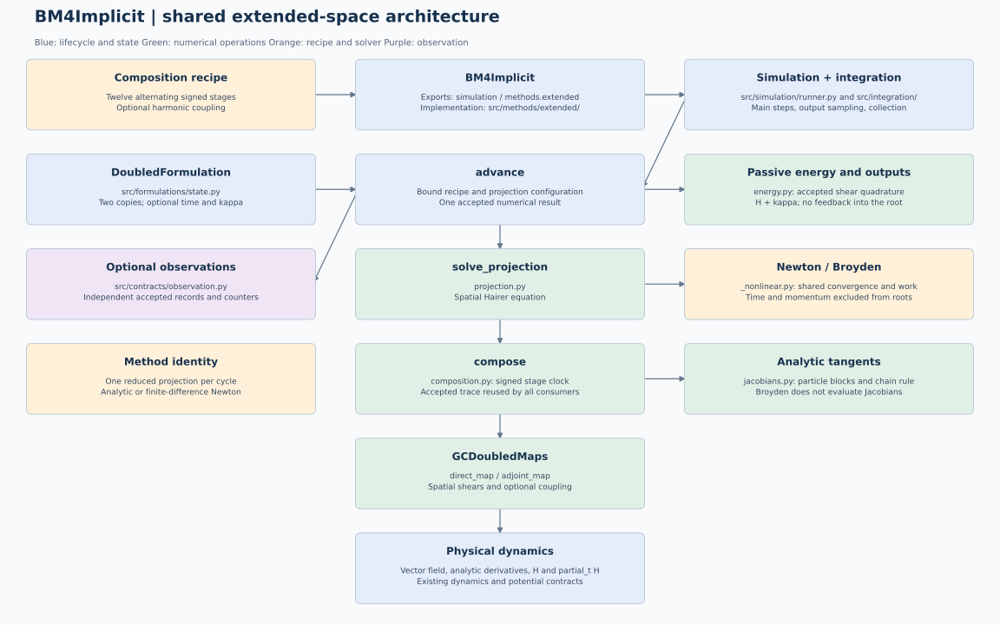

# BM4Implicit: shared extended-space execution

Twelve alternating signed stages; Optional harmonic coupling. One reduced projection per cycle; Analytic or finite-difference Newton.

For a package-oriented view with the reduced equation, twelve-stage recipe,
solver strategies and observation records, see the
[detailed BM4 architecture](bm4-detailed-architecture.md)
([SVG](bm4-detailed-architecture.svg), [PlantUML](bm4-detailed-architecture.puml)).
The compact diagram above is retained.

The numerical implementation now lives in `src/methods/extended/`.
Public method names and exports from `simulation` remain unchanged. ABBA6
now uses one outer projection; its observer substeps are unprojected pairs and
its nonlinear-work arrays have one column per accepted step. The former `methods/abba/` and
`methods/bm4/` import adapters have been removed. Internal imports point directly
to the defining modules in `methods.extended`.

See the [shared architecture](../../extended/simulation/extended-simulation-architecture.md)
for the module responsibilities, state layouts, solver equations, energy
normalization and validation contracts. The model's mathematical entry point
remains [theory.tex](../tex/theory.tex), with its compiled
[theory.pdf](../tex/theory.pdf).

## Numerical path

Constructor controls use the typed scalar validators in `methods._validation`,
including rejection of boolean tolerances and coupling frequencies. Shared
Newton/Broyden input and cached-residual checks live in `methods._nonlinear`;
they preserve ownership of the initial arrays and do not add residual evaluations.
Numerical convergence and singularity guards remain in their solve loops.

Initialization binds this model's recipe and options. The ordinary implicit
path is `advance -> solve_projection -> compose -> direct_map / adjoint_map`.
Explicit midpoint methods use `midpoint_step` in place of the nonlinear
projection. ABBA4 and ABBA6 both project once around the complete
unprojected composition; their recipes contain six and fourteen stages.

One reduced Hairer equation surrounds the complete twelve-stage cycle.
Newton retains analytic and finite-difference strategies; Broyden uses the same
reduced equation without analytic Jacobians.

The shared composition keeps signed durations and the nonautonomous stage
clock: adjoint maps evaluate at the start of their substep and direct maps at
its end. ABBA uses no harmonic coupling. BM4 retains its configurable coupling
and the existing defaults for each public class.

## Accepted states and diagnostics

For N planar particles, both methods use two spatial copies with 4N components.
Optional passive energy adds N time entries and N physical momenta, producing
6N accepted internal components. Physical outputs and observer snapshots remain
2N dimensional. Time and momentum never enter a nonlinear root.

The accepted shear trace feeds common normalized momentum quadrature after the
spatial computation. The diagnostic `H + kappa - H_initial` measures energy
balance for the time-dependent Hamiltonian. Tracking does not alter the spatial
map or its nonlinear stopping scale. Analytic tangents and BM4 stage events reuse
the retained spatial stages; no extra spatial replay is required for them.

The integration coordinator still owns accepted intervals, off-grid output
sampling, history collection and observer dispatch. Energy arrays follow saved
times and nonlinear-work arrays follow accepted main steps. Existing method
and observer tests remain applicable, supplemented by
`tests/test_extended_family.py`.

## Diagram maintenance

Regenerate this diagram and the shared family view with
`python scripts/render_extended_architecture.py`. The script writes the
PlantUML/Graphviz source and corresponding SVG/PNG views from the same graph
specification. Historical files marked `old` or `proposed` are archival diagrams;
the figure above describes the current implementation.

## Complete integration executor

`simulate(problem, method, request, execution=Execution())` delegates the complete
integration to `Execution.run`. Import the executor with `from execution import
Execution`. It uses the existing local method implementation and does not
configure runtime resources. A subclass can replace the whole integration while
`simulate` retains final `Solution` construction and validation. Backend choices
remain separate in `options=ExecutionOptions(...)`. See the
[executor contract](../../../simulation/execution.md) for the extension interface.
The numerical stages, projection equations and integration controllers described
above remain inside this execution boundary.

`Execution_Modal` implements this boundary for remote NumPy/SciPy or JAX CPU
integrations. Results return to the local machine for validation and subsequent
persistence; see the [Modal executor guide](../../../simulation/modal-execution.md).

The matched Poincare star study selects this canonical implementation with
`studies.poincare_rho_sweep.RhoStarConfig(method="BM4Implicit", ...)`.
It applies one reduced projection around every complete composition, with explicit
analytic-Newton controls shared with GaussLegendre4: absolute tolerance `1e-12`,
relative tolerance `1e-11`, at most 40 corrections and Jacobian relative step
`cbrt(eps)`. These study defaults do not change the method's constructor defaults.
The study accepts JAX CPU float64 and retains the initial state and integer-cycle
returns, scalar solver metadata, and optional folded coordinates. Full per-step
diagnostic arrays are excluded from these cycle-only archives. The field, geometry
and radial Hamiltonian normalization remain the same across methods; no independent
trajectory-accuracy reference is inferred from a successful integration.
The radial Poincare study also supports explicit additional initial positions via
`studies.poincare_gap_probes.GapProbeSeeds` and `prepare_gap_probes`. These use
the same canonical method, physical dynamics, complete-step grid and JAX/Modal
execution as the original star. Probe archives retain their own seed geometry
and IDs and are saved separately; viewers append their coordinates after checking
the field fingerprint, scientific settings and aligned cycle times. The eight
gap probes have IDs 41–48, with two positions per gap selected at rho=0.30 and
reused for all eleven rho values. See the
[batch and persistence protocol](../../../simulation/modal-execution.md#additional-particles-inside-saved-poincare-gaps).

## Initial-state ownership

`InitialValueProblem` captures the validated physical state, particle count, and
independent layout at construction. A later edit to the original initial-state
provider does not change this run's formulation. Physical layouts are owned by
`contracts.state_layout`; compatible external providers need no inheritance from
initial-condition classes. Built-in dynamics keep their physical parameters
immutable. See the shared [layout and ownership contract](../../../dynamics/protocols.md#physical-layouts-and-problem-ownership).

## Newton iterate callbacks

The keyword-only `newton_observer` receives independent read-only
`contracts.nonlinear.NewtonIteration` snapshots, including the physical
projection multiplier. It observes already computed residuals and supports
independent or nested runs without global instrumentation. Direct advances and
off-grid output solves emit iterates; diagnostic `map_state` replay does not.
Broyden, compiled JAX, and remote Modal execution reject this optional Python
callback. See the [shared callback and particle-solve contract](../../extended/simulation/extended-simulation-architecture.md#explicit-newton-iteration-observation).

### Shared comparison records

The three-, four-, and five-method comparison campaigns share method construction,
alignment checks, and metric reductions in `studies._comparison`; their public
study entry points remain unchanged. Reference, accuracy, summary, and execution
records belong to `contracts.comparison`, and CSV readers reconstruct those same
record types without importing study orchestration. Energy-bound and parallel
BM4 archive records belong to `contracts.study_results`, with explicit re-exports
from their established study modules. See the
[record ownership contract](../../../simulation/integration-architecture.md#comparison-and-archive-record-ownership).

## Compiled fixed-step contract

Fixed-step methods inherit `CompiledFixedMethod` and provide a JAX adapter that
returns `contracts.compiled.CompiledStep`. The shared `integration/jax_fixed.py`
loop knows no concrete numerical method; each method owns its compiled stages
and statistics. See [JAX execution](../../../simulation/jax-execution.md).

## Potential evaluation boundary

`Potential` performs standalone SciPy evaluation without execution options.
During JAX simulation preparation, the dynamics binding constructs and reuses a
`JaxPotentialEvaluator` from the existing prepared splines; it does not refit them.
Backend selection remains a simulation concern. See the
[shared potential contract](../../../dynamics/jax-potential-evaluation.md).
