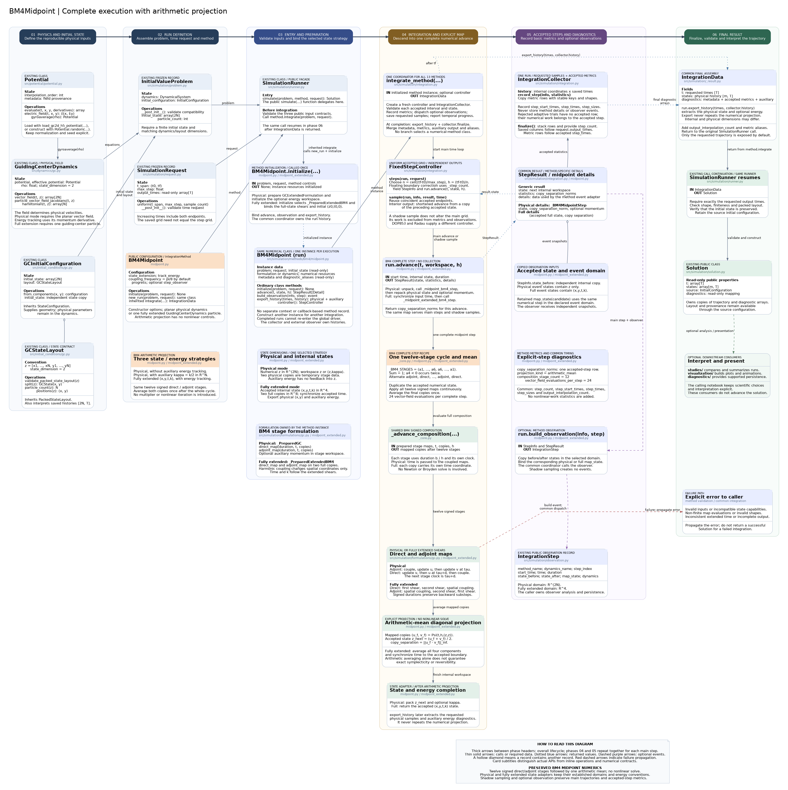

# BM4Midpoint simulation architecture

[Editable source](bm4-midpoint-simulation-architecture.puml) · [Scalable diagram (SVG)](bm4-midpoint-simulation-architecture.svg)

The diagram retains the detailed six-phase layout: physical inputs, run
definition, preparation, numerical execution, accepted-step records, and final
result. Read phases horizontally and operations vertically; the cards show
module paths, inputs/outputs and the selected numerical recipe.




`BM4Midpoint` implements the complete twelve-stage BM4 composition followed by
one arithmetic-mean diagonal projection. It is available from `simulation`,
`simulation.methods`, and `simulation.methods.bm4`. The term midpoint means
averaging the two final copies; it does not mean the implicit midpoint RK rule.

## Method instances and integration lifecycle

This method inherits `IntegrationMethod.integrate(problem, request)`, shared by
all 13 public methods. It calls `new_run(problem, request)` to create a fresh
instance of the same numerical class. That instance's `initialize` validates
capabilities and sets its formulation, initial internal state and metadata.
There is no separate context or callback-based method record.

| Operation on the numerical class | Responsibility |
|---|---|
| `initialize(problem, request)` | Initialize this run's resources once; return `None` |
| `advance(t, state, h)` | Execute numerical work and return state, statistics and typed details |
| `build_observation(info, step)` | Construct a method-specific event with independent snapshots |
| `export_history(times, history)` | Extract physical output and auxiliary diagnostics |
| `controller()` | Select fixed or adaptive accepted-step scheduling |

`integrate_method(run)` owns the common loop. Its `IntegrationCollector` saves
requested samples and copied accepted-step metric rows, without retaining
numerical details or events. The method owns the formulation and any live solver.
Analysis and persistence remain in `diagnostics/`; observers remain caller-owned.

Constructor options remain reusable through `simulate`. Per-run resources are
excluded from reconstruction, and initial state and metadata are isolated as
read-only copies. A completed or failed run cannot be integrated again; create a
fresh run. Call `new_run` for low-level access rather than resetting `initialize`.

`FixedStepController` calls `run.advance` with the exact effective duration and
uses independent shortened maps for interior output times. DOP853/Radau's
controller calls their ordinary `advance` on the live solver with an upper step
bound and reads the actual accepted endpoint. Dense sampling retains the backend.

Metric rows follow `step_times`; physical and auxiliary histories follow
`Solution.t`. Common fields are `step_count`, `step_start_times`, `step_times`,
`step_sizes` and `output_interpolation_count`. Shadow work and extra observer-only
work are excluded from accepted numerical counters.

See the [generic architecture](../../../simulation/integration-architecture.md)
for the lifecycle, adaptive semantics and extension guide. Executable contracts
are in `tests/test_method_integration.py` and `tests/test_adaptive_integration.py`.

## Configuration and usage

```python
from simulation import BM4Midpoint, simulate

method = BM4Midpoint(
    state_extension="physical",
    track_energy=True,
    coupling_frequency=0.5,
)
solution = simulate(problem, method, request)
```

The first four fields reproduce `ABBA2Midpoint`'s configuration order:
`state_extension="physical"`, `progress=False`, `step_observer=None`, and
`track_energy=False`. The additional `coupling_frequency` defaults to `pi/8`,
and must be finite and non-negative. `BM4Implicit` independently defaults to zero. Zero disables mixing.
There are no nonlinear-solver, residual-formulation, or projection-placement axes.

| State strategy | Accepted map | Temporary copies | Energy and observer contract |
|---|---|---|---|
| Physical | Packed `(x_1,...,x_p,y_1,...,y_p)` | Two physical copies | Optional auxiliary `kappa` per particle; observers see the physical map |
| Fully extended | One `(x,y,t,k)` | Two complete extended copies | Energy tracking is inherent; observers see the four-dimensional accepted map |

Physical mode accepts planar `DynamicalSystem` implementations with a
`GCInitialConfiguration`; energy tracking additionally requires
`ExtendedHamiltonianSystem`. Fully extended mode requires one
`GuidingCenterDynamics` particle, matching ABBA's limitation. Both return only
physical coordinates in `solution.states`.

## Runtime responsibilities

| Module | Responsibility |
|---|---|
| `simulation/methods/bm4/midpoint.py` | Immutable configuration, physical one-step map and prepared state/observation adapters |
| `simulation/methods/bm4/midpoint_extended.py` | Extended direct/adjoint maps and full-state preparation |
| `simulation/methods/bm4/_core.py` | Shared BM4 coefficients, signed stage clock and twelve-stage traversal |
| `simulation/formulations/gc.py` | Prepared physical GC shears, harmonic coupling and optional summed momentum |
| `simulation/methods/abba/_configuration.py`, `_energy.py`, `maps/extended.py`, `state.py` | Reused state validation, energy normalization, extended shears and energy extraction |
| `simulation/integration.py` | Common controller, sampling, collection and result assembly |

Every main step embeds the accepted state on the diagonal, runs the complete
composition, and averages once. Copy separation is measured before averaging.
Physical stages use exactly the same direct/adjoint time convention and coupling
as `BM4Implicit`. Fully extended stages evaluate the field at each copy's own
time and apply harmonic mixing only to the spatial coordinates. Extended time
is checked and pinned to the analytically known grid time after each full step.

Physical energy tracking evolves the prepared formulation's summed momentum
`k=2*kappa` during the stages and accepts `kappa=k/2`. It does not affect physical
trajectories. Fully extended mode evolves the two intrinsic momenta, averages
them and reports `direct_k` normalization.

## Diagnostics and verification

`IntegrationStep` is emitted once per main step. Retained `map_state` callbacks
replay the corresponding fixed-time physical or extended map. Shadow output
steps produce neither events nor entries in `copy_separation_norms`.

Common diagnostics include `projection_kind="arithmetic_mean"`,
`composition_stage_count=12`, `vector_field_evaluations_per_step=24`,
`nonlinear_unknown_dimension=0`, state dimensions, coupling frequency and
energy-tracking configuration. Physical state dimensions exclude auxiliary
momentum, as in ABBA2Midpoint. Energy fields follow the same ABBA conventions.

`tests/test_bm4_midpoint.py` checks an independent stage replay, fourth-order
convergence against an exact oscillator and a nonautonomous DOP853 reference,
batch/scalar agreement, energy normalization, observation replay, output-grid
independence and invalid configurations. Arithmetic projection preserves the
base method's order but does not guarantee exact symplecticity or reversibility.

The mathematical definition is in [theory](../tex/theory.pdf). Physical dynamics
remain documented in the [shared dynamics contract](../../../dynamics/gc2d-h5-import.md).

## Accuracy, runtime and multiplier comparison

`studies.bm4_projection_comparison` compares `BM4Midpoint` with `BM4Implicit`
using the same measured field, initial configuration, step and output grid.
Its default numerical configuration follows the 200-cycle protocol. The
focused runnable study uses three particles on one radius at fractions
`(0.10, 0.25, 0.40)` of the cell half-width; this user-selected geometry replaces
the usual distributed initial sample. The first comparison uses 20 cycles to
limit the expensive reference campaign. This shorter horizon must not be
interpreted as a long-time conclusion about the standard 200-cycle problem.

From the project root:

```bash
MPLBACKEND=Agg .venv/bin/python scripts/run_bm4_projection_comparison.py --cycles 20
MPLBACKEND=Agg .venv/bin/python scripts/run_bm4_projection_comparison.py --cycles 200
```

The result folder is
`notebooks/developements/bm4_projection_comparison/<cycles>_cycles/`.
It contains a portable `results.npz`, `summary.json`, scientific PNG figures,
`trajectories.mp4` and `report.html`. Add `--render-only` to regenerate the report
without repeating integrations. The companion `comparison.ipynb` keeps the
scientific parameters explicit and loads the completed result by default.

DOP853 supplies the accuracy reference and a tighter Radau run audits its
resolution. Timings use a warm-up and three serial repeats in alternating order
with one BLAS thread, excluding reference and observer costs. An additional
untimed implicit replay captures all signed multiplier components and verifies
that its trajectory equals the timed trajectory. Only BM4Implicit has mu;
BM4Midpoint's discarded copy separation is plotted independently.

Reusable orchestration belongs to `src/studies/bm4_projection_comparison.py`,
persistence to `src/diagnostics/bm4_comparison.py`, and plotting, animation and
report generation to `src/visualization/bm4_projection_comparison.py`.

### Saved standard reference through normalized time 35

The current `comparison.ipynb` uses the standard saved radial reference at
`data/trajectory/h5_three_radial_dop853_t35` on its original normalized time
interval `[0,35]`, with no period conversion. Initial radii are `(0.1,0.2,0.3)`
times the full cell period. The reference settings are DOP853 tolerances
`5e-13/5e-15`, maximum step `0.0025`, and Radau tolerances `5e-14/5e-16`, maximum
step `0.00125`. Both methods take 350 complete steps of size `0.1`.

The runner supports `--standard-reference --compute-only` and
`--standard-reference --render-only`; results are stored in `standard_t35/`.
The notebook also contains the full computation and rendering calls and loads
saved results by default. It exposes all physical, numerical and animation
parameters. Reference checksums, physical metadata, initial states and the
effective-field fingerprint must match before the saved reference can be used.
Output nodes are selected from existing saved samples to floating-point
roundoff, without interpolation or extrapolation.

`audit_saved_reference_refinement` compares the standard trajectory with the
existing coarser DOP853 artifact `outputs/developements/accuracy/h5_three_radial/v2`
over the full `[0,35]` prefix. Its tolerances and maximum step are twice those
of the standard reference. All 3501 reference samples are retained for the
per-particle refinement and Radau plots. Historical reference solver runtimes
describe the original source run to time 200 and are not reported as timings
for this prefix. Float64 arithmetic, integration errors and empirical reference
discrepancies are documented separately. No analytic orbit is available for
the interpolated measured field.
