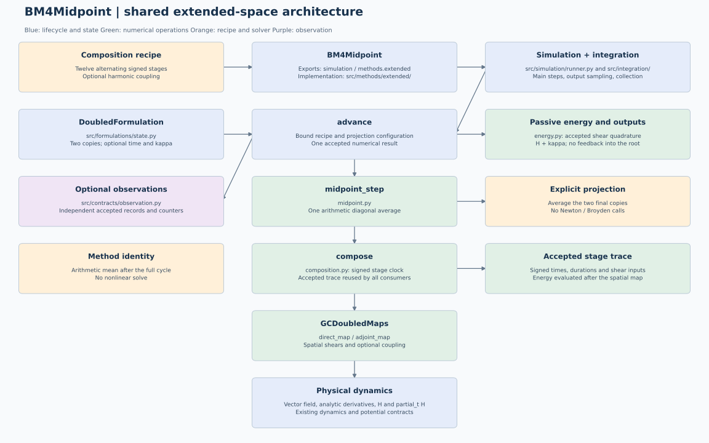

# BM4Midpoint: shared extended-space execution

Twelve alternating signed stages; Optional harmonic coupling. Arithmetic mean after the full cycle; No nonlinear solve.

The numerical implementation now lives in `src/methods/extended/`.
Public method names and exports from `simulation` remain unchanged. ABBA6
now uses one outer projection; its observer substeps are unprojected pairs and
its nonlinear-work arrays have one column per accepted step. The former `methods/abba/` and
`methods/bm4/` import adapters have been removed. Internal imports point directly
to the defining modules in `methods.extended`.

See the [shared architecture](../../extended/simulation/extended-simulation-architecture.md)
for the module responsibilities, state layouts, solver equations, energy
normalization and validation contracts. The model's mathematical entry point
remains [theory.tex](../tex/theory.tex), with its compiled
[theory.pdf](../tex/theory.pdf).

## Numerical path

Initialization binds this model's recipe and options. The ordinary implicit
path is `advance -> solve_projection -> compose -> direct_map / adjoint_map`.
Explicit midpoint methods use `midpoint_step` in place of the nonlinear
projection. ABBA4 and ABBA6 both project once around the complete
unprojected composition; their recipes contain six and fourteen stages.

The arithmetic projection averages the two copies once after the complete
recipe. It has no nonlinear solver and does not imply exact symplecticity or
reversibility.

The shared composition keeps signed durations and the nonautonomous stage
clock: adjoint maps evaluate at the start of their substep and direct maps at
its end. ABBA uses no harmonic coupling. BM4 retains its configurable coupling
and the existing defaults for each public class.

## Accepted states and diagnostics

For N planar particles, both methods use two spatial copies with 4N components.
Optional passive energy adds N time entries and N physical momenta, producing
6N accepted internal components. Physical outputs and observer snapshots remain
2N dimensional. Time and momentum never enter a nonlinear root.

The accepted shear trace feeds common normalized momentum quadrature after the
spatial computation. The diagnostic `H + kappa - H_initial` measures energy
balance for the time-dependent Hamiltonian. Tracking does not alter the spatial
map or its nonlinear stopping scale. Analytic tangents and BM4 stage events reuse
the retained spatial stages; no extra spatial replay is required for them.

The integration coordinator still owns accepted intervals, off-grid output
sampling, history collection and observer dispatch. Energy arrays follow saved
times and nonlinear-work arrays follow accepted main steps. Existing method
and observer tests remain applicable, supplemented by
`tests/test_extended_family.py`.

## Diagram maintenance

Regenerate this diagram and the shared family view with
`python scripts/render_extended_architecture.py`. The script writes the
PlantUML/Graphviz source and corresponding SVG/PNG views from the same graph
specification. Historical files marked `old` or `proposed` are archival diagrams;
the figure above describes the current implementation.

## Optional JAX execution

This model supports `simulate(..., execution=Execution(backend="jax", device="cpu"))`
(or a configured `device="gpu"`) with explicit float64. The complete fixed time
loop, particle stages, applicable nonlinear/projection solves and passive energy
quadrature remain on that device until final NumPy `Solution` export. Its
coefficients, physical-state tolerance scaling and sampling conventions are
unchanged. JAX rejects unconverged solves explicitly. Diagnostics report
`execution_mode="device_resident"`. Python step observers and progress reporting
require the default CPU path.

Import `Execution` from `contracts.execution`. Omission preserves existing
SciPy/NumPy execution. See the [shared execution contract](../../../simulation/jax-execution.md)
for supported physical systems, solver details, timing scope and validation.

## Dimensional HDF5 star calculation

The local calculation notebook at
`notebooks/developements/poincare_section/bm4_midpoint_jax_star/calculation.ipynb`
uses `studies.poincare_star.PoincareStarConfig` and `run_poincare_star` to compose
the existing dimensional HDF5 field with BM4Midpoint and JAX. The generic
`initial_conditions.star.radial_star` constructor places equally spaced
particles on equally spaced straight arms, excluding repeated center points.
Its canonical import is from `initial_conditions.star`.

The example has eight arms of 16 particles, each extending 40% of the source
cell width from its center. Coordinates remain in meters; time is `tau=t/T0`.
The established `rho_hat=0.3` is converted to meters using `lambda/(2*pi)`.
Five forcing cycles at 40 steps per cycle produce 200 complete steps and six
saved states, including initialization. The default destination preserves the
notebook hierarchy in the configured bucket. The paired `visualisation.ipynb`
loads that canonical archive without integration and exports `poincare_star.html`.
It uses `visualization.poincare_star` and the shared comparison viewer for fixed
initial positions, animated once-per-cycle returns, arm/particle selection and
synchronized zoom/panning. Axes remain in meters; optional periodic folding
changes only display copies, never the saved physical coordinates.
