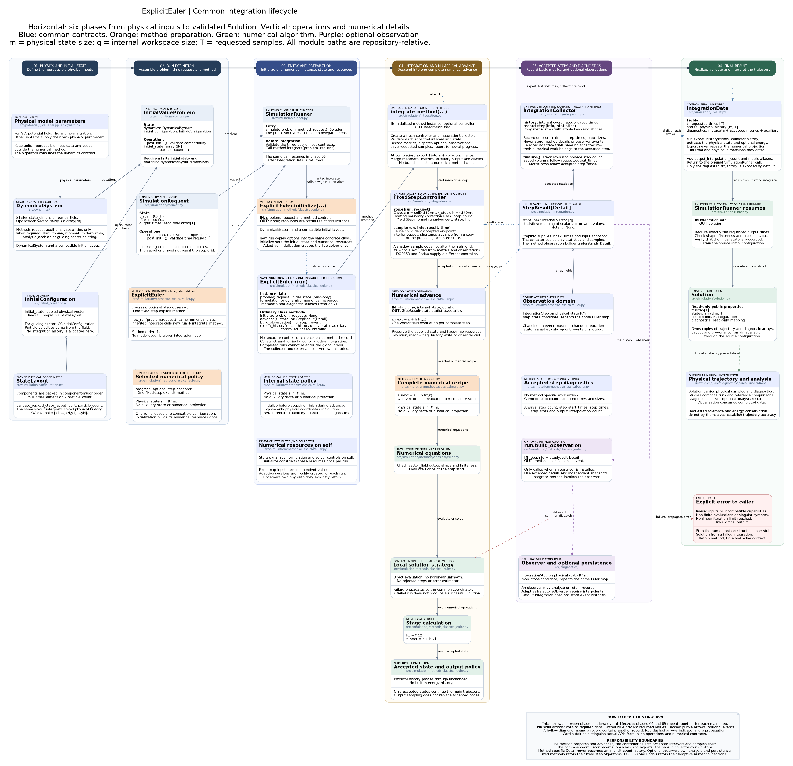

# Explicit Euler fixed-grid integration architecture

[Editable diagram](explicit-euler-simulation-architecture.puml) · [Scalable diagram](explicit-euler-simulation-architecture.svg)



The diagram retains the six-phase BM4 layout, including public contracts,
preparation, numerical equations, accepted records, optional observers and errors.

## Method instances and integration lifecycle

This method inherits `IntegrationMethod.integrate(problem, request)`, shared by
all 13 public methods. It calls `new_run(problem, request)` to create a fresh
instance of the same numerical class. That instance's `initialize` validates
capabilities and sets its formulation, initial internal state and metadata.
There is no separate context or callback-based method record.

| Operation on the numerical class | Responsibility |
|---|---|
| `initialize(problem, request)` | Initialize this run's resources once; return `None` |
| `advance(t, state, h)` | Execute numerical work and return state, statistics and typed details |
| `build_observation(info, step)` | Construct a method-specific event with independent snapshots |
| `export_history(times, history)` | Extract physical output and auxiliary diagnostics |
| `controller()` | Select fixed or adaptive accepted-step scheduling |

`integrate_method(run)` owns the common loop. Its `IntegrationCollector` saves
requested samples and copied accepted-step metric rows, without retaining
numerical details or events. The method owns the formulation and any live solver.
Analysis and persistence remain in `diagnostics/`; observers remain caller-owned.

Constructor options remain reusable through `simulate`. Per-run resources are
excluded from reconstruction, and initial state and metadata are isolated as
read-only copies. A completed or failed run cannot be integrated again; create a
fresh run. Call `new_run` for low-level access rather than resetting `initialize`.

`FixedStepController` calls `run.advance` with the exact effective duration and
uses independent shortened maps for interior output times. DOP853/Radau's
controller calls their ordinary `advance` on the live solver with an upper step
bound and reads the actual accepted endpoint. Dense sampling retains the backend.

Metric rows follow `step_times`; physical and auxiliary histories follow
`Solution.t`. Common fields are `step_count`, `step_start_times`, `step_times`,
`step_sizes` and `output_interpolation_count`. Shadow work and extra observer-only
work are excluded from accepted numerical counters.

See the [generic architecture](../../../simulation/integration-architecture.md)
for the lifecycle, adaptive semantics and extension guide. Executable contracts
are in `tests/test_method_integration.py` and `tests/test_adaptive_integration.py`.

## Public method

```python
from simulation import ExplicitEuler, SimulationRequest, simulate

events = []
solution = simulate(
    problem,
    ExplicitEuler(progress=False, step_observer=events.append),
    SimulationRequest.uniform(
        t_span=(0.0, 1.0),
        max_step=0.05,
        sample_count=21,
    ),
)
```

`ExplicitEuler` is a numerical dataclass with reusable constructor options with two options:

- `progress` enables the shared stderr progress display for complete main-grid
  steps; and
- `step_observer` receives complete-step records when it is not `None`.

It structurally implements the public `NumericalMethod` protocol through
`integrate(problem, request)`.

## Complete-step map

For a fixed start time `t_n`, candidate state `z`, and duration `h`, the method-owned
`advance` closure evaluates

\[
\Phi_{t_n,h}(z)=z+h f(t_n,z).
\]

This is the classical forward-Euler map implemented in
`src/simulation/methods/classical/euler.py`. Each invocation performs one
validated vector-field evaluation. There are no stages, nonlinear iterations,
Jacobian evaluations, adaptive error estimates, or rejected steps.

The closure captures `t_n`, `h`, and the exact dynamics instance. The accepted
main state and the observer-facing `map_state` therefore use the same fixed-time,
fixed-duration numerical map.

## Output-independent fixed grid

`FixedStepController` owns temporal scheduling. For

\[
T=t_f-t_0,
\]

it selects the smallest positive integer count represented by the implementation
as

\[
N=\max\left(1,
\left\lceil\operatorname{nextafter}
\left(\frac{T}{h_{\max}},-\infty\right)\right\rceil\right),
\qquad h=\frac{T}{N}.
\]

The `nextafter` adjustment prevents an upward floating-point rounding of an
exact ratio from adding a spurious step. The main trajectory then advances on
the uniform nodes `t_n = t_0 + n h`.

Requested output times do not define this main grid. For every requested time
inside `[t_n, t_{n+1}]`, the runner stores

- the already accepted state when the request matches `t_{n+1}` within the
  shared time tolerance;
- the preceding main state when it matches `t_n`; or
- an independent shadow Euler step of duration `t_output - t_n`, starting from
  a copy of the state at `t_n`.

Shadow results are saved and then discarded from the integration state. They
cannot change later main nodes, do not update the progress display, and never request observation construction.

## Complete-step observations

When `step_observer` is configured, each main step emits one `IntegrationStep`:

| Field | Explicit-Euler value |
|---|---|
| `dynamics_name` | Concrete dynamics class name. |
| `method_name` | `"ExplicitEuler"`. |
| `step_index` | Zero-based main-grid index. |
| `start_time`, `time`, `duration` | `t_n`, `t_n + h`, and `h`. |
| `state_before`, `state_after` | Independent copies of both physical snapshots. |
| `map_state` | The captured forward-Euler map `Phi_(t_n,h)`. |
| `dynamics` | The exact dynamics instance used by the step. |

Shadow advances never emit records. The method has no stage observer because a
forward-Euler update has no separately represented internal stage lifecycle.

## Integration data and solution boundary

After stepping completes, the common coordinator creates `IntegrationData`
with

- `t = request.output_times`;
- `states` equal to the saved physical history; and
- the common step count, accepted timing arrays and interior-sample count.

`SimulationRunner` then requires the returned times to equal the request,
checks the finite two-dimensional history and its initial column, validates the
packed layout, and constructs an immutable `Solution`. Explicit Euler does not
publish energy, Jacobian, stage, or nonlinear-solver diagnostics.

## Tested contract

`tests/test_euler.py` uses the canonical rotation problem and verifies with
zero numerical tolerance that one step with `h = 0.1` returns exactly

\[
z_1=z_0+0.1 f(0,z_0),
\]

and reports one step through `solution.n_steps`. `tests/test_package_layout.py`
also verifies that `ExplicitEuler` remains available from the public
`simulation` package and in an interpreter where Matplotlib imports are
disabled.

## Related files

- [`src/simulation/methods/classical/euler.py`](../../../../src/simulation/methods/classical/euler.py)
- [`src/simulation/integration.py`](../../../../src/simulation/integration.py)
- [`src/simulation/runner.py`](../../../../src/simulation/runner.py)
- [`src/simulation/observation.py`](../../../../src/simulation/observation.py)
- [`tests/test_euler.py`](../../../../tests/test_euler.py)
- [`tests/test_package_layout.py`](../../../../tests/test_package_layout.py)
- [`Companion PlantUML diagram`](explicit-euler-simulation-architecture.puml)
