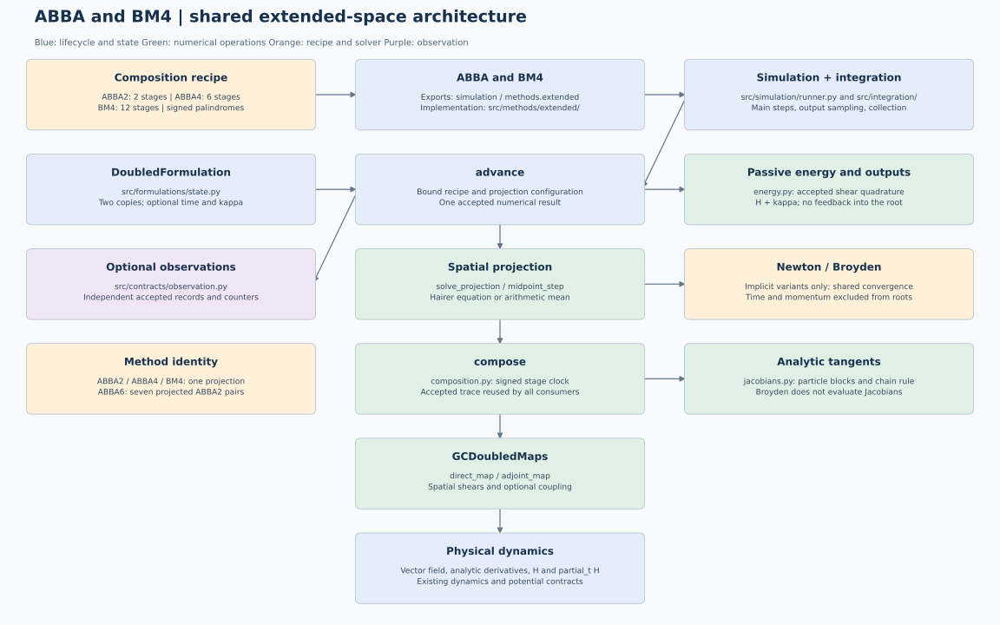

# Shared extended-space implementation

ABBA and BM4 share the numerical implementation in
[`src/methods/extended/`](../../../../src/methods/extended/).
`extended` names an internal implementation family, not a new public method.
The public classes, constructor defaults, and exports from `simulation` remain
available. Public observer records and diagnostic keys are retained.
The canonical package is `methods.extended`; `formulations`, `integration`,
and `contracts` are sibling packages. Old `simulation.methods.*`,
`methods.abba.*`, and `methods.bm4.*` routes have been removed. Explicit public
exports refer to the canonical implementation, without module aliases or import
hooks. See the [import migration table](../../../simulation/integration-architecture.md#public-api-and-imports).

The canonical mathematical entry point is [theory.tex](../tex/theory.tex), with
its deliberate compiled [theory.pdf](../tex/theory.pdf). Diagram sources and
views can be regenerated with
`python scripts/render_extended_architecture.py`. That script writes matching
PlantUML/Graphviz graph specifications and fixed-layout SVG/PNG views from one
node-and-edge specification; an external Graphviz executable is not required.

## Execution and responsibilities

The ordinary implicit path is `advance -> solve_projection -> compose ->
direct_map / adjoint_map`. Initialization binds the recipe, spatial formulation,
solver options and Jacobian strategy once. The generic integration coordinator
continues to own step scheduling, output sampling, observer dispatch and history
collection. Compatibility step views used by diagnostics are outside this path.

| Module or component | Responsibility |
|---|---|
| `extended/composition.py` | Validated immutable signed recipes and one direct/adjoint traversal |
| `extended/projection.py` | Reduced and simultaneous spatial Hairer equations for any recipe |
| `methods/_nonlinear.py` | Shared Newton/Broyden convergence, iteration limits and counters |
| `extended/jacobians.py` | Exact ordered particle-block tangents and centered-difference fallback |
| `extended/energy.py` | Passive normalized momentum quadrature from accepted shear inputs |
| `extended/records.py` | Numerical stage traces, projection results and aggregate statistics |
| `extended/midpoint.py` | Explicit arithmetic projection after the complete composition |
| `extended/abba.py`, `extended/bm4.py` | Existing public configurations' preparation and accepted-step operations |
| `formulations/gc.py` | `GCDoubledMaps`: spatial direct/adjoint maps and optional coupling |
| `formulations/state.py` | `DoubledFormulation`: accepted internal state and physical/energy extraction |

The small order-specific ABBA classes select their existing recipes. BM4 and
ABBA observers adapt the common accepted numerical traces to their established
public event types. BM4 stage events no longer require a second spatial replay.
The `abba_*` compatibility helpers and `legacy_full_*` modules support existing
diagnostic imports; historical full time/momentum projection is not a runtime
configuration of this family.

## Recipes and numerical identity

| Public method | Unprojected recipe | Diagonal projection per complete step |
|---|---|---|
| `ABBA2Implicit` | Adjoint/direct pair with weights `(1/2, 1/2)` | One reduced or simultaneous Hairer solve |
| `ABBA4Implicit` | Three continuous ABBA pairs: `(gamma, delta, gamma)` | One reduced or simultaneous solve around all six stages |
| `ABBA6Implicit` | Seven signed **projected** ABBA2 steps | Seven independent solves, preserving the Yoshida construction |
| `BM4Implicit` | Twelve alternating stages with mirrored BM4 weights | One reduced Hairer solve |
| `ABBA2Midpoint` | One ABBA pair | One arithmetic mean |
| `BM4Midpoint` | Complete twelve-stage BM4 recipe | One arithmetic mean |

`ABBA4ImplicitSingleProjection` remains the existing deprecated factory for
`ABBA4Implicit`. ABBA uses uncoupled maps. BM4 preserves its configurable harmonic
coupling and defaults (`0` for implicit BM4, `pi/8` for midpoint BM4).

In execution order, even-indexed stages are adjoint and odd-indexed stages are
direct. If `s = coefficient * h`, an adjoint evaluates at the current stage
clock and a direct map at `clock + s`; then the clock advances by `s`. Negative
weights reverse both the signed subflow and its clock. Reflection exchanges
adjoint and direct maps. Palindromic weights and unit total duration are checked,
but they alone do not prove fourth- or sixth-order accuracy.

Projection placement is part of method identity. In particular, replacing
ABBA6's seven projected pairs by one projection around fourteen stages would
change the method. An arithmetic mean is not a symmetric Hairer solve and does
not imply exact symplecticity or reversibility.

## State, projection and derivatives

For N independent planar particles the physical state has 2N components in
component-major order. The numerical composition uses two spatial copies with
4N components. Accepted copies are equal. `track_energy=True` appends N times
and N normalized momenta to the accepted workspace, producing 6N components;
the physical trajectory remains 2N dimensional. See the shared
[dynamics protocols](../../../dynamics/protocols.md).

With `E z = (z,z)`, `G = [I,-I]` and `N = G.T`, the reduced equation is
`r(mu) = G Psi_h(E z + N mu) + 2 mu = 0`. Its Jacobian is
`G D(Psi_h) N + 2 I`. Broyden starts from `4 I` and evaluates no analytic
Jacobians. The simultaneous ABBA equation retains both output copies and the
multiplier as 6N unknowns; its zero-step block Jacobian initializes Broyden.
Both formulations call the same general Newton/Broyden primitives.

Analytic Newton composes exact stage tangents from retained shear sources and
solves independent particle blocks (2 by 2 reduced, 6 by 6 simultaneous). It
replays no vector-field stages to obtain those sources. BM4's existing optional
centered-difference strategy differentiates the complete doubled map instead.
All roots retain the physical scale `atol + rtol * max(1, ||z||_inf)`.

## Energy, sampling and observation

Only the converged residual's trace is used for accepted energy quadrature.
`Delta kappa = (1/2) sum_j s_j (-partial_t H)(t_j, z_j)` sums individual
signed **shears**, two per direct/adjoint stage. The factor one half converts the
doubled Hamiltonian's summed momentum to physical kappa. Coupling does not alter
that passive momentum. The diagnostic is `H(t,z) + kappa - H(t0,z0)`;
it measures energy balance, not conservation of the time-dependent physical H.

Tracking neither enlarges a nonlinear root nor adds spatial field evaluations,
and all public observers receive independent physical snapshots. Numerical
traces do not allocate public events when no observer is requested. Shadow steps
for off-grid output remain independent and do not emit main-step observations.
Per-particle energy histories align with saved times; nonlinear work arrays align
with accepted main steps. Existing diagnostic names and result shapes are kept.

## Verification

`tests/test_extended_family.py` checks common solver binding, public class
identity, coefficient validation, projection placement, endpoint shear
agreement, signed nonautonomous reversibility, analytic tangents, and passive
tracking/observation without extra spatial work. Existing method tests retain
convergence order, projection equations, observer compatibility, energy balance,
vectorized particles and sampling contracts. Refactoring permits floating-point
roundoff changes, not changed coefficients, clocks or mathematical methods.
