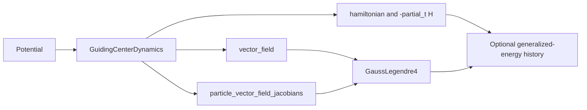

# Guiding-center contract for Gauss--Legendre order four

## Scope

`GaussLegendre4` is a general implicit Runge--Kutta method. It accepts any
`DynamicalSystem`; a guiding-center implementation with available spatial
Hessians additionally exposes exact particle Jacobians, so the production path
avoids dense numerical differentiation.

For `GuidingCenterDynamics`, the packed physical state is

\[
z=[x_1,\ldots,x_N,y_1,\ldots,y_N]^T,
\qquad
\dot z=f(t,z).
\]

Particles are independent under one prescribed potential. The method therefore
uses the existing `particle_vector_field_jacobians(t, z)` capability, whose
result has shape `(N, 2, 2)`. The nonlinear solve is assembled as `N`
independent `4 x 4` systems instead of one dense `4N x 4N` system.

## Hamiltonian convention

For one particle,

\[
f(t,x,y)=\begin{pmatrix}-\partial_y H(t,x,y)\\
\partial_x H(t,x,y)\end{pmatrix}.
\]

The physical symplectic form is

\[
\Omega=\begin{pmatrix}0&1\\-1&0\end{pmatrix}.
\]

The time-dependent problem can also be interpreted through

\[
K(x,y,t,k)=H(t,x,y)+k,
\qquad \dot k=-\partial_t H.
\]

When `track_energy=True`, Gauss4 advances `k` with the same two Gauss nodes and
weights used for the physical state. This update is triangular: `k` never feeds
back into `(x,y)`, so enabling energy tracking leaves the physical trajectory
unchanged.

## Capability selection

`newton_jacobian_method` has three values:

| Value | Behavior |
|---|---|
| `"auto"` | Probes exact planar guiding-center blocks at the initial state and falls back to centered differences when they are unavailable. |
| `"analytic"` | Strictly requires available planar `GuidingCenterJacobianSystem` blocks and uses batched `4 x 4` Newton systems. |
| `"finite_difference"` | Builds a dense centered-difference Jacobian for a general ODE. |

The analytic path requires the potential interpolation to supply the second
spatial derivatives needed by `GuidingCenterDynamics`. In particular, a valid
lower-order interpolant can still be integrated with `"auto"`; it resolves to
the generic dense finite-difference path instead of failing during Newton.

## Dependencies

The companion source diagram is
[`guiding-center-contract.puml`](guiding-center-contract.puml).
