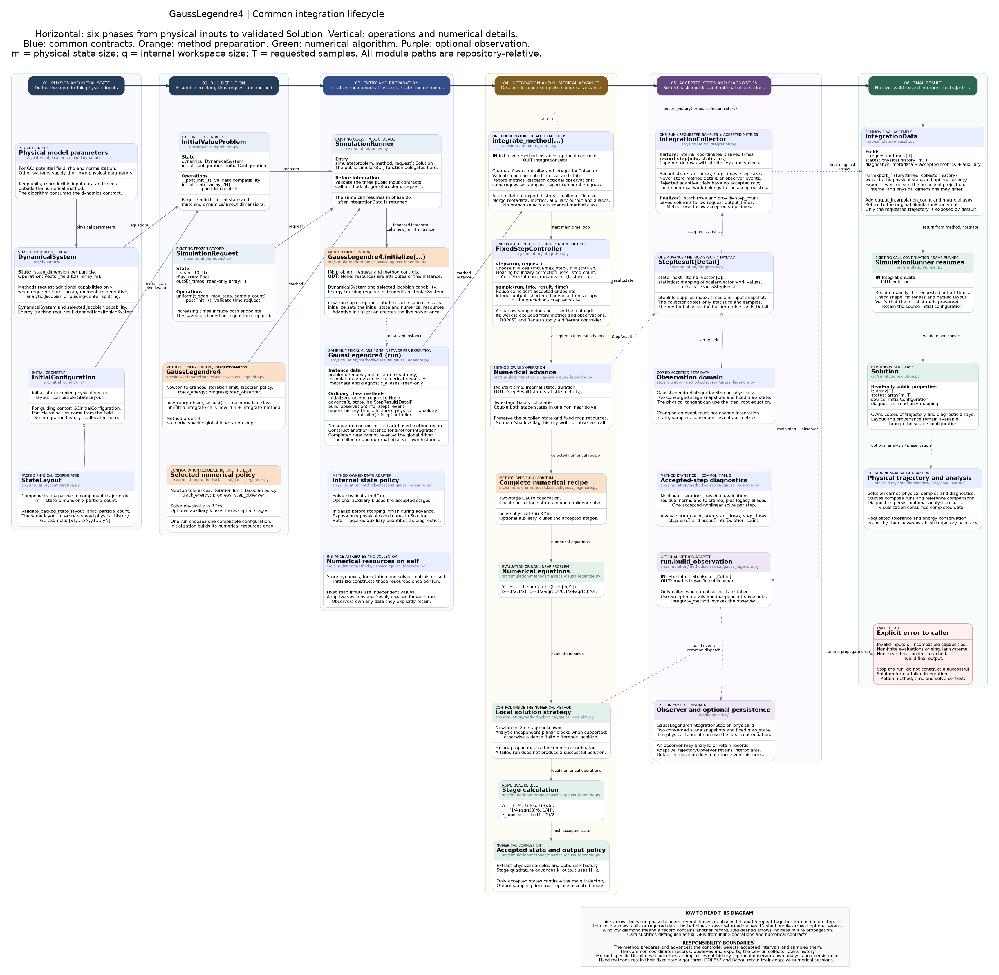

# Gauss--Legendre two-stage fourth-order integration

[Editable diagram](gauss-legendre4-simulation-architecture.puml) · [Scalable diagram](gauss-legendre4-simulation-architecture.svg)



The diagram retains the six-phase BM4 layout, including public contracts,
preparation, numerical equations, accepted records, optional observers and errors.

## Method instances and integration lifecycle

This method inherits `IntegrationMethod.integrate(problem, request)`, shared by
all 13 public methods. It calls `new_run(problem, request)` to create a fresh
instance of the same numerical class. That instance's `initialize` validates
capabilities and sets its formulation, initial internal state and metadata.
There is no separate context or callback-based method record.

| Operation on the numerical class | Responsibility |
|---|---|
| `initialize(problem, request)` | Initialize this run's resources once; return `None` |
| `advance(t, state, h)` | Execute numerical work and return state, statistics and typed details |
| `build_observation(info, step)` | Construct a method-specific event with independent snapshots |
| `export_history(times, history)` | Extract physical output and auxiliary diagnostics |
| `controller()` | Select fixed or adaptive accepted-step scheduling |

`integrate_method(run)` owns the common loop. Its `IntegrationCollector` saves
requested samples and copied accepted-step metric rows, without retaining
numerical details or events. The method owns the formulation and any live solver.
Analysis and persistence remain in `diagnostics/`; observers remain caller-owned.

Constructor options remain reusable through `simulate`. Per-run resources are
excluded from reconstruction, and initial state and metadata are isolated as
read-only copies. A completed or failed run cannot be integrated again; create a
fresh run. Call `new_run` for low-level access rather than resetting `initialize`.

`FixedStepController` calls `run.advance` with the exact effective duration and
uses independent shortened maps for interior output times. DOP853/Radau's
controller calls their ordinary `advance` on the live solver with an upper step
bound and reads the actual accepted endpoint. Dense sampling retains the backend.

Metric rows follow `step_times`; physical and auxiliary histories follow
`Solution.t`. Common fields are `step_count`, `step_start_times`, `step_times`,
`step_sizes` and `output_interpolation_count`. Shadow work and extra observer-only
work are excluded from accepted numerical counters.

See the [generic architecture](../../../simulation/integration-architecture.md)
for the lifecycle, adaptive semantics and extension guide. Executable contracts
are in `tests/test_method_integration.py` and `tests/test_adaptive_integration.py`.

## Public method

```python
from simulation import GaussLegendre4

method = GaussLegendre4(
    track_energy=True,
    newton_absolute_tolerance=1e-14,
    newton_relative_tolerance=1e-13,
    newton_max_iterations=40,
    newton_jacobian_method="analytic",
)
```

The method is a two-stage Gauss collocation Runge--Kutta scheme. It is symmetric,
has global order four, stage order two, and is symplectic for canonical
Hamiltonian systems when the implicit equations are solved exactly.

## Tableau and collocation equations

Let

\[
r=\frac{\sqrt{3}}{6},\qquad
c=\begin{pmatrix}\frac12-r\\\frac12+r\end{pmatrix},
\]

\[
A=\begin{pmatrix}
\frac14 & \frac14-r\\
\frac14+r & \frac14
\end{pmatrix},
\qquad
b=\begin{pmatrix}\frac12\\\frac12\end{pmatrix}.
\]

For a complete step from `(t_n, z_n)`, the two stage states solve

\[
R_i(Z_1,Z_2)=Z_i-z_n-h\sum_{j=1}^{2}a_{ij}
f(t_n+c_jh,Z_j)=0.
\]

The accepted state is

\[
z_{n+1}=z_n+\frac{h}{2}(f_1+f_2).
\]

The predictor is `Z_i = z_n + c_i h f(t_n, z_n)`. Newton stops when

\[
\max_i\lVert R_i\rVert_\infty
\leq
\mathrm{atol}+\mathrm{rtol}\max(1,\lVert z_n\rVert_\infty).
\]

## Exact guiding-center Newton blocks

With `J_i = D_z f(t_n+c_i h,Z_i)`, one particle uses

\[
M=
\begin{pmatrix}
I-ha_{11}J_1 & -ha_{12}J_2\\
-ha_{21}J_1 & I-ha_{22}J_2
\end{pmatrix}.
\]

The code gathers the component-major residual into
`[R_1x, R_1y, R_2x, R_2y]`, solves the batched array with shape `(N, 4, 4)`,
and restores `[x_1,...,x_N,y_1,...,y_N]` for each stage.

## Exact ideal-root tangent

For planar `GuidingCenterJacobianSystem` dynamics,
`GaussLegendre4IntegrationStep` retains all data required for the exact
ideal-root tangent. If
`S_i = partial Z_i / partial z_n`, implicit differentiation gives

\[
M\begin{pmatrix}S_1\\S_2\end{pmatrix}
=\begin{pmatrix}I\\I\end{pmatrix},
\qquad
D\Phi_h=I+\frac{h}{2}(J_1S_1+J_2S_2).
\]

This is the tangent of the ideal converged root. It is the correct object for
checking the algebraic symplectic property. It does not differentiate the
finite Newton stopping rule. The individual-evaluation study therefore also
computes sparse centered-difference Jacobians of `step.map_state`; those audits
expose any tolerance-dependent departure of the implemented map.

For a generic `DynamicalSystem`, the integrator still emits the stage event and
can be audited through `step.map_state`, but the public analytic tangent helper
does not claim an exact particle-block Jacobian.

## Energy extension

At the two converged stages,

\[
g_i=-\partial_t H(t_n+c_i h,Z_i),
\qquad
k_{n+1}=k_n+\frac{h}{2}(g_1+g_2).
\]

The returned diagnostics include `extended_momentum` and the maximum drift of
`K=H+k`. A general nonlinear Hamiltonian is not expected to have exact energy
conservation under Gauss4; bounded small drift is the relevant diagnostic.
The individual study performs a separate untimed energy run whose output grid
contains every complete integration node, so its maximum drift is not
undersampled by the coarser common accuracy grid.

## Fixed grid and observations

`FixedStepController` defines an output-independent main grid. Off-grid saved
times are evaluated by shadow steps from the preceding main node. Shadow steps
do not emit observations and do not contribute to Newton diagnostic arrays.

The method publishes:

- `step_count`, `stage_count`, and `designed_order`;
- requested and resolved Jacobian strategies;
- per-main-step Newton corrections, residual evaluations, final residuals, and
  tolerances;
- optional extended momentum and generalized-energy error.

## Evaluation notebooks

- `notebooks/developements/gauss_legendre4_individual_evaluation.ipynb` studies
  symplecticity, trajectory accuracy, runtime, generalized energy, observed
  order, and persistent order reduction. The reduction decision requires two
  adjacent deficits resolved above both the DOP853/Radau audit floor and a
  second trajectory computed with proportionally tighter Newton tolerances.
- `notebooks/developements/gauss_legendre4_vs_bm4_accuracy_runtime.ipynb`
  compares Gauss4 with `BM4Implicit` using the same physical problem,
  refinement grid, Newton tolerances, DOP853/Radau reference, and alternated
  runtime repetitions. It reports direct equal-step ratios and interpolated
  runtime ratios inside the common measured accuracy range.

The companion component diagram is
[`gauss-legendre4-simulation-architecture.puml`](gauss-legendre4-simulation-architecture.puml).

## References

- J. M. Sanz-Serna, "Runge--Kutta schemes for Hamiltonian systems," *BIT*,
  28 (1988), 877--883.
- E. Hairer, C. Lubich, and G. Wanner, *Geometric Numerical Integration*,
  second edition, Springer, 2006.
