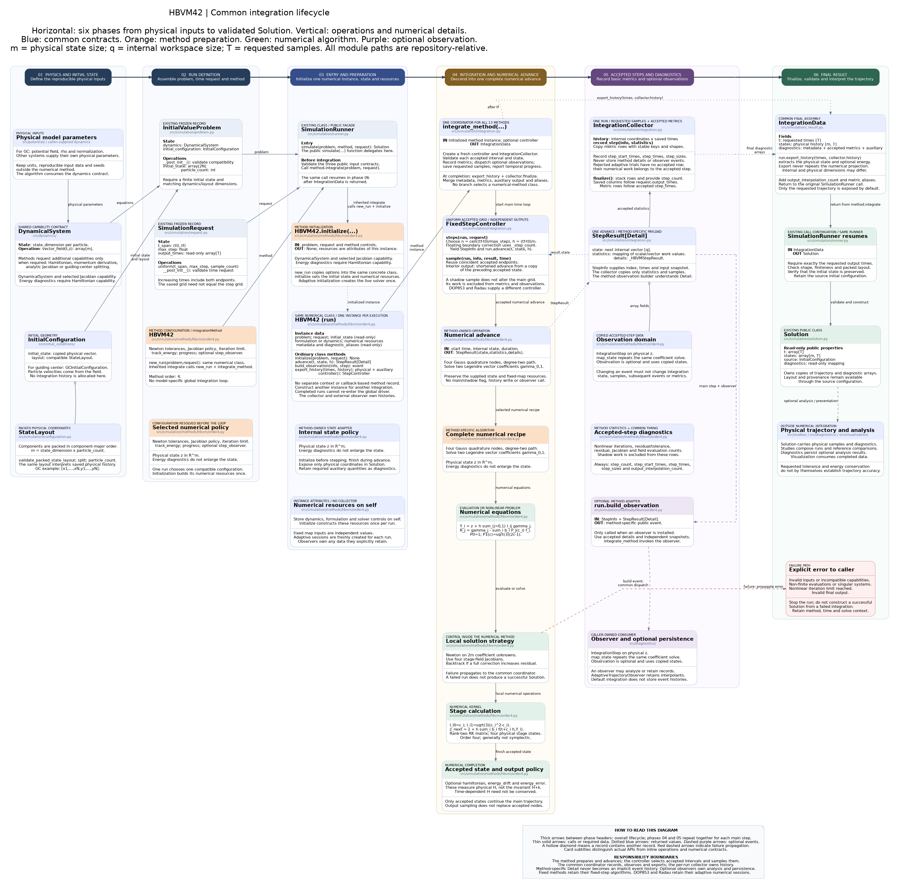

# HBVM(4,2) numerical method and evaluation architecture

[Editable diagram](hbvm42-simulation-architecture.puml) · [Scalable diagram](hbvm42-simulation-architecture.svg)



The diagram retains the six-phase BM4 layout, including public contracts,
preparation, numerical equations, accepted records, optional observers and errors.

## Method instances and integration lifecycle

This method inherits `IntegrationMethod.integrate(problem, request)`, shared by
all 13 public methods. It calls `new_run(problem, request)` to create a fresh
instance of the same numerical class. That instance's `initialize` validates
capabilities and sets its formulation, initial internal state and metadata.
There is no separate context or callback-based method record.

| Operation on the numerical class | Responsibility |
|---|---|
| `initialize(problem, request)` | Initialize this run's resources once; return `None` |
| `advance(t, state, h)` | Execute numerical work and return state, statistics and typed details |
| `build_observation(info, step)` | Construct a method-specific event with independent snapshots |
| `export_history(times, history)` | Extract physical output and auxiliary diagnostics |
| `controller()` | Select fixed or adaptive accepted-step scheduling |

`integrate_method(run)` owns the common loop. Its `IntegrationCollector` saves
requested samples and copied accepted-step metric rows, without retaining
numerical details or events. The method owns the formulation and any live solver.
Analysis and persistence remain in `diagnostics/`; observers remain caller-owned.

Constructor options remain reusable through `simulate`. Per-run resources are
excluded from reconstruction, and initial state and metadata are isolated as
read-only copies. A completed or failed run cannot be integrated again; create a
fresh run. Call `new_run` for low-level access rather than resetting `initialize`.

`FixedStepController` calls `run.advance` with the exact effective duration and
uses independent shortened maps for interior output times. DOP853/Radau's
controller calls their ordinary `advance` on the live solver with an upper step
bound and reads the actual accepted endpoint. Dense sampling retains the backend.

Metric rows follow `step_times`; physical and auxiliary histories follow
`Solution.t`. Common fields are `step_count`, `step_start_times`, `step_times`,
`step_sizes` and `output_interpolation_count`. Shadow work and extra observer-only
work are excluded from accepted numerical counters.

See the [generic architecture](../../../simulation/integration-architecture.md)
for the lifecycle, adaptive semantics and extension guide. Executable contracts
are in `tests/test_method_integration.py` and `tests/test_adaptive_integration.py`.

## Method definition

`simulation.HBVM42` is the Hamiltonian Boundary Value Method with four
Gauss--Legendre quadrature nodes and a degree-two polynomial path. Let
`c_i, b_i`, `i=1,...,4`, be Gauss--Legendre nodes and weights on `[0,1]`, and
let the first two orthonormal shifted Legendre polynomials be

\[
P_0(c)=1, \qquad P_1(c)=\sqrt{3}(2c-1).
\]

Define

\[
I_{i0}=c_i, \qquad I_{i1}=\sqrt{3}(c_i^2-c_i).
\]

The implementation solves for only two vector coefficients
`gamma = (gamma_0, gamma_1)`:

\[
Y_i=y_n+h\sum_{j=0}^{1} I_{ij}\gamma_j,
\]

\[
R_j(\gamma)=\gamma_j-
\sum_{i=1}^{4}b_iP_j(c_i)f(t_n+c_i h,Y_i)=0.
\]

The accepted Runge--Kutta update is

\[
y_{n+1}=y_n+h\sum_{i=1}^{4}b_i f(t_n+c_i h,Y_i).
\]

Equivalently, the Runge--Kutta matrix is

\[
A=\mathcal I_2\mathcal P_2^T\Omega,
\]

and has rank two. The nonlinear unknown therefore has size `2 * state_size`,
not `4 * state_size`.

## Numerical properties

- Classical order: `2s = 4`.
- Quadrature degree: seven, from four Gauss nodes.
- Polynomial energy conservation: an autonomous polynomial Hamiltonian of
  degree `nu` is conserved when `k >= nu*s/2`. With `k=4`, `s=2`, all
  Hamiltonians through degree four satisfy this condition.
- Symplecticity: HBVM(k,s) is generally not symplectic when `k > s`.
  HBVM(4,2) must therefore be assessed with a map-Jacobian defect rather than
  labeled symplectic by construction.

## Nonlinear solve

Each step uses a first-order stage predictor and Newton iterations on the
rank-two residual. The Jacobian is assembled from the four stage field
Jacobians. `jacobian_method="auto"` selects exact particle blocks when the
dynamics implements `GuidingCenterJacobianSystem`, and centered finite
differences otherwise. Backtracking is activated only if a full Newton update
increases the residual.

The stopping threshold is

\[
\varepsilon_{abs}+\varepsilon_{rel}
\max(1,\lVert y_n\rVert_\infty).
\]

Main-grid diagnostics include nonlinear iterations, residual norms, effective
tolerances, residual and Jacobian evaluations, and vector-field evaluations.
Shadow output samples are deliberately excluded from these arrays, consistent
with the shared fixed-grid integration contract.

## Energy diagnostics

`track_energy=True` stores

- `hamiltonian`: one row per particle and one column per saved time;
- `energy_drift`: `H(t_n,y_n)-H(t_0,y_0)`;
- `energy_error`: the maximum absolute drift.

These names describe physical Hamiltonian drift. For explicitly time-dependent
systems this is a diagnostic value, not an invariant error.

## Public usage

```python
from simulation import HBVM42, InitialValueProblem, SimulationRequest, simulate

solution = simulate(
    problem,
    HBVM42(
        absolute_tolerance=1e-14,
        relative_tolerance=1e-13,
        jacobian_method="auto",
        track_energy=True,
    ),
    SimulationRequest.uniform(
        t_span=(0.0, 8.0),
        max_step=0.1,
        sample_count=21,
    ),
)
```

## Optional complete-step observation

`HBVM42(step_observer=callback)` builds an `IntegrationStep` from copied physical
snapshots. Its retained `map_state` repeats the complete rank-two coefficient
solve at the observed time and duration. The common integrator dispatches the
callback after acceptance; shadow calculations emit no events. Energy recording
still evaluates physical Hamiltonian drift without adding momentum coordinates.

## Notebook studies

`studies.run_hbvm42_evaluation` composes the individual experiment. For each
step it computes:

- trajectory-RMS and final-state error against an independent DOP853 solve;
- median and minimum execution time over explicit warm-up/repetition counts;
- maximum absolute and relative energy error;
- centered-difference symplecticity defects of one step and of the final flow;
- observed global orders and signed order reductions `4 - p_observed`;
- nonlinear iterations and field-evaluation work.

`studies.run_hbvm42_bm4_comparison` evaluates HBVM(4,2) and `BM4Implicit`
against the same DOP853 endpoint for one `GuidingCenterDynamics` problem, on
identical complete fixed-step grids, with identical nonlinear tolerances and
timing repetitions. BM4 uses only the physical accepted state and one reduced
Hairer projection around each complete twelve-stage cycle. Only accuracy and
execution time enter that comparison; energy and symplecticity remain in the
individual notebook.

The corresponding plots live in `visualization.hbvm42`. The notebooks contain
only explicit scientific configuration, study calls, tables, and
interpretation.

## Files

- `src/simulation/methods/hbvm/order4.py`: coefficients, reduced residual,
  Newton solve, integration, and diagnostics.
- `src/studies/hbvm42.py`: quartic validation system and both study runners.
- `src/visualization/hbvm42.py`: individual and comparison figures.
- `notebooks/developements/hbvm42_individual_evaluation.ipynb`: all individual
  metrics.
- `notebooks/developements/hbvm42_vs_bm4_accuracy_runtime.ipynb`: accuracy and
  runtime comparison.
