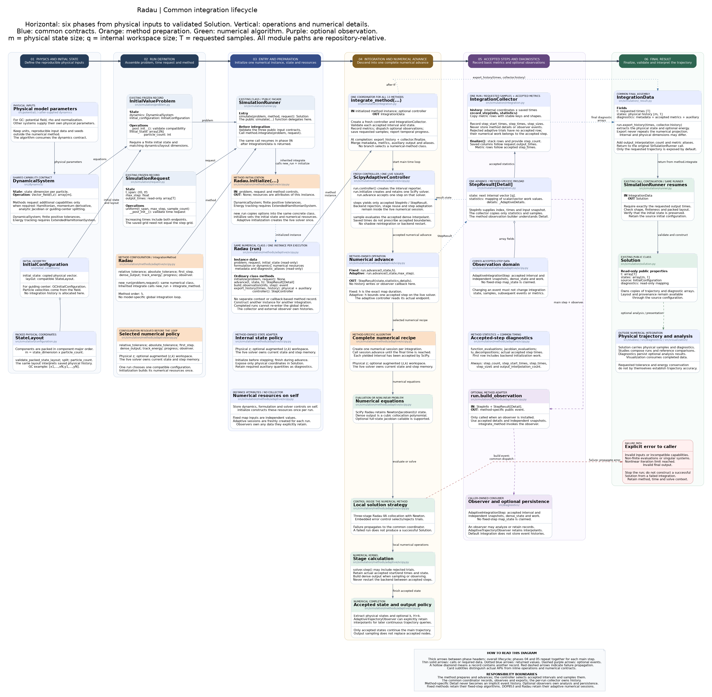

# Radau adaptive integration architecture

[Editable diagram](radau-simulation-architecture.puml) · [Scalable diagram](radau-simulation-architecture.svg)



`Radau` is a public numerical method using the same preparation, coordinator,
collector and result validation as the fixed-step methods. Its backend is
SciPy's `Radau` solver. The six-phase diagram retains the detailed BM4 structure.

```python
from simulation import Radau, SimulationRequest, simulate

solution = simulate(
    problem,
    Radau(relative_tolerance=1e-10, absolute_tolerance=1e-12),
    SimulationRequest.uniform(t_span=(0.0, 1.0), max_step=0.025, sample_count=101),
)
```

## Method instances and integration lifecycle

This method inherits `IntegrationMethod.integrate(problem, request)`, shared by
all 13 public methods. It calls `new_run(problem, request)` to create a fresh
instance of the same numerical class. That instance's `initialize` validates
capabilities and sets its formulation, initial internal state and metadata.
There is no separate context or callback-based method record.

| Operation on the numerical class | Responsibility |
|---|---|
| `initialize(problem, request)` | Initialize this run's resources once; return `None` |
| `advance(t, state, h)` | Execute numerical work and return state, statistics and typed details |
| `build_observation(info, step)` | Construct a method-specific event with independent snapshots |
| `export_history(times, history)` | Extract physical output and auxiliary diagnostics |
| `controller()` | Select fixed or adaptive accepted-step scheduling |

`integrate_method(run)` owns the common loop. Its `IntegrationCollector` saves
requested samples and copied accepted-step metric rows, without retaining
numerical details or events. The method owns the formulation and any live solver.
Analysis and persistence remain in `diagnostics/`; observers remain caller-owned.

Constructor options remain reusable through `simulate`. Per-run resources are
excluded from reconstruction, and initial state and metadata are isolated as
read-only copies. A completed or failed run cannot be integrated again; create a
fresh run. Call `new_run` for low-level access rather than resetting `initialize`.

`FixedStepController` calls `run.advance` with the exact effective duration and
uses independent shortened maps for interior output times. DOP853/Radau's
controller calls their ordinary `advance` on the live solver with an upper step
bound and reads the actual accepted endpoint. Dense sampling retains the backend.

Metric rows follow `step_times`; physical and auxiliary histories follow
`Solution.t`. Common fields are `step_count`, `step_start_times`, `step_times`,
`step_sizes` and `output_interpolation_count`. Shadow work and extra observer-only
work are excluded from accepted numerical counters.

See the [generic architecture](../../../simulation/integration-architecture.md)
for the lifecycle, adaptive semantics and extension guide. Executable contracts
are in `tests/test_method_integration.py` and `tests/test_adaptive_integration.py`.

## Numerical session and variable steps

`initialize` validates the dynamics and creates **one live solver** on the
method instance. `advance` calls `solver.step()` and returns after one acceptance
or failure. Its `h` argument is an upper bound; the controller reads the actual
endpoint from the retained solver. Stages, rejected trials and any Jacobian or
factorization reuse survive successive calls. Output times only select samples.

Three-stage Radau IIA collocation with Newton. Embedded error control selects/rejects trials. SciPy Radau retains Newton/Jacobian/LU state. Dense output is a cubic collocation polynomial. Optional full-state jacobian callable is supported.

`max_step` is an upper bound. The positive tolerances control local error; they
are not a guaranteed global trajectory-error bound. `first_step=None` delegates
initial-step selection to SciPy. Reusing the public method configuration through
`simulate` creates a fresh instance, solver and collector. An initialized instance
is for one execution; `advance` must start from its live solver state. Adaptive
observations expose dense output, not a fixed-duration candidate-state map.

## Output and observation

Requested samples use the accepted dense interpolant. They never restart the
solver or force the accepted grid through every saved time. Endpoint sampling
preserves `solve_ivp(t_eval=...)` arithmetic. `dense_output=False` computes
interpolants when outputs or observers need them; `dense_output=True` computes
every accepted interpolant without storing it in the common collector.

`AdaptiveIntegrationStep` supplies accepted times, copied before/after states,
work counters and `dense_state(time)`. It deliberately exposes no `map_state`:
the accepted adaptive algorithm depends on step-selection history. A fixed-map
symplecticity observer cannot be substituted for an adaptive trajectory observer.

For opt-in continuous retention:

```python
from diagnostics import AdaptiveTrajectoryObserver

trajectory = AdaptiveTrajectoryObserver()
method = Radau(dense_output=True, step_observer=trajectory)
solution = simulate(problem, method, request)
state_at_time = trajectory.evaluate(0.5)  # Must lie inside request.t_span.
```

The observer owns the interpolants and rejects queries outside its retained
interval. Other observers may stream records to storage without retaining the
full trajectory. Reusing a stateful observer requires a fresh instance or an
explicit caller-managed lifecycle.

## Work counters and energy

`function_evaluations`, `jacobian_evaluations` and `lu_decompositions` contain
one row per accepted step. The first row includes initialization work. Rejected
trial work is included in the next accepted row, with no rejected-step event.
Additional dense-output work needed only by an observer is excluded from the
main counters; `dense_output=True` includes that interpolation work explicitly.
The original counters of SciPy match when the same output policy is requested.

`track_energy=True` integrates `(z,k)` with `k'=-partial_t H`, starting from
zero momentum per particle, and requires `ExtendedHamiltonianSystem`. Error
control applies to the entire augmented state, so enabling tracking can change
the accepted grid and physical floating-point trajectory. Export returns physical
states, `extended_momentum` and the generalized-energy diagnostic for `H+k`.

The reference, accuracy, energy-balance and recurrence studies now compose these
public methods. Their scientific tolerances and reference-refinement checks
remain the study's responsibility.

See [theory](../tex/theory.tex), [PDF](../tex/theory.pdf),
[adaptive implementation](../../../../src/simulation/methods/adaptive/scipy.py)
and [behavioral tests](../../../../tests/test_adaptive_integration.py).

`Radau(jacobian=callable)` forwards an optional full-state Jacobian. With energy
tracking it must cover all augmented coordinates. `None` uses SciPy finite
differences. This option is separate from the fixed methods’ Newton controls.
