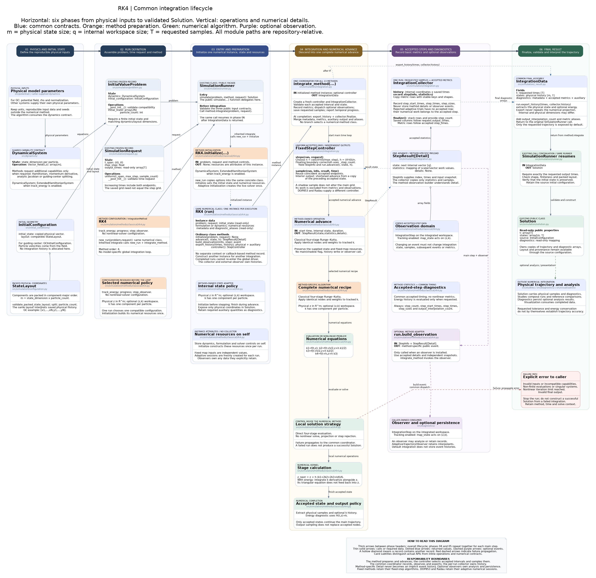

# Classical fourth-order Runge--Kutta integration architecture

[Editable diagram](rk4-simulation-architecture.puml) · [Scalable diagram](rk4-simulation-architecture.svg)



The diagram retains the six-phase BM4 layout, including public contracts,
preparation, numerical equations, accepted records, optional observers and errors.

## Method instances and integration lifecycle

This method inherits `IntegrationMethod.integrate(problem, request)`, shared by
all 13 public methods. It calls `new_run(problem, request)` to create a fresh
instance of the same numerical class. That instance's `initialize` validates
capabilities and sets its formulation, initial internal state and metadata.
There is no separate context or callback-based method record.

| Operation on the numerical class | Responsibility |
|---|---|
| `initialize(problem, request)` | Initialize this run's resources once; return `None` |
| `advance(t, state, h)` | Execute numerical work and return state, statistics and typed details |
| `build_observation(info, step)` | Construct a method-specific event with independent snapshots |
| `export_history(times, history)` | Extract physical output and auxiliary diagnostics |
| `controller()` | Select fixed or adaptive accepted-step scheduling |

`integrate_method(run)` owns the common loop. Its `IntegrationCollector` saves
requested samples and copied accepted-step metric rows, without retaining
numerical details or events. The method owns the formulation and any live solver.
Analysis and persistence remain in `diagnostics/`; observers remain caller-owned.

Constructor options remain reusable through `simulate`. Per-run resources are
excluded from reconstruction, and initial state and metadata are isolated as
read-only copies. A completed or failed run cannot be integrated again; create a
fresh run. Call `new_run` for low-level access rather than resetting `initialize`.

`FixedStepController` calls `run.advance` with the exact effective duration and
uses independent shortened maps for interior output times. DOP853/Radau's
controller calls their ordinary `advance` on the live solver with an upper step
bound and reads the actual accepted endpoint. Dense sampling retains the backend.

Metric rows follow `step_times`; physical and auxiliary histories follow
`Solution.t`. Common fields are `step_count`, `step_start_times`, `step_times`,
`step_sizes` and `output_interpolation_count`. Shadow work and extra observer-only
work are excluded from accepted numerical counters.

See the [generic architecture](../../../simulation/integration-architecture.md)
for the lifecycle, adaptive semantics and extension guide. Executable contracts
are in `tests/test_method_integration.py` and `tests/test_adaptive_integration.py`.

## Public method

[`RK4`](../../../../src/simulation/methods/classical/rk4.py) is exported from
the public `simulation` package:

```python
from simulation import InitialValueProblem, RK4, SimulationRequest, simulate

solution = simulate(
    problem,
    RK4(
        track_energy=False,
        progress=False,
        step_observer=None,
    ),
    SimulationRequest.uniform(
        t_span=(0.0, 1.0),
        max_step=0.01,
        sample_count=101,
    ),
)
```

The method consumes `DynamicalSystem` directly. Its preparation binds the
vector field and optional energy extension to the common execution contract.

## Complete-step map

For one step of duration $h$ from $(t_n,z_n)$, the implementation evaluates

\[
\begin{aligned}
k_1 &= f(t_n,z_n), \\
k_2 &= f\left(t_n+\frac{h}{2},z_n+\frac{h}{2}k_1\right), \\
k_3 &= f\left(t_n+\frac{h}{2},z_n+\frac{h}{2}k_2\right), \\
k_4 &= f(t_n+h,z_n+h k_3),
\end{aligned}
\]

and accepts

\[
z_{n+1}=z_n+\frac{h}{6}(k_1+2k_2+2k_3+k_4).
\]

Thus each complete or shadow step performs four vector-field evaluations. For
sufficiently smooth problems the method has global order four. It is explicit,
has no nonlinear solve, and is not symplectic or energy-preserving for a
general Hamiltonian system. The non-autonomous stage times are part of the
implemented map rather than all stages being evaluated at $t_n$.

## Fixed main grid and shadow output samples

[`FixedStepController`](../../../../src/simulation/integration.py) constructs a
uniform main grid independently of `output_times`. For duration $T=t_f-t_0$,
it chooses the smallest robust integer $M$ satisfying the requested bound and
uses

\[
h_{main}=\frac{T}{M}\leq \texttt{max_step}.
\]

The intended final main node is therefore `t_span[1]`, with floating-point
comparisons covered by the helper's endpoint tolerance. `max_step` is an upper
bound, not necessarily the accepted duration.

When a requested saved time lies strictly between two main nodes, the
fixed-grid helper evaluates a shorter shadow RK4 step from the preceding main
state. This sample

- does not replace or perturb the main-grid state;
- does not affect any later output sample;
- does not increment `step_count`; and
- is called with `observe=False`.

Output density therefore does not define the numerical trajectory. Main steps
alone may update the progress display and emit observations.

## Complete-step observations

If `step_observer` is configured, every main step emits one
[`IntegrationStep`](../../../../src/simulation/observation.py) containing

- the method and dynamics names, main-step index, start and end times, and
  duration;
- independent `state_before` and `state_after` snapshots; and
- `map_state`, the same fixed-time, fixed-duration RK4 map applied to another
  candidate state.

RK4 does not emit separate stage observations. Shadow steps never invoke the
observer. The exposed map lets opt-in diagnostics differentiate the actual
implemented step without duplicating RK4 formulas.

For example,
[`GCAreaSymplecticityObserver`](../../../../src/diagnostics/symplecticity/area.py)
uses centered differences of `map_state` to compute the local Jacobian
$J_n=D\Phi_h(z_n)$, then advances the accumulated numerical-flow tangent

\[
DG_{n+1}=J_nDG_n.
\]

It reports transported-area error, determinant error, and the normalized
canonical defects

\[
\frac{\lVert J_n^T\Omega J_n-\Omega\rVert_F}{\lVert\Omega\rVert_F},
\qquad
\frac{\lVert DG_n^T\Omega DG_n-\Omega\rVert_F}{\lVert\Omega\rVert_F}.
\]

These are measured defects, not a symplecticity claim. The RK4 area study uses
`track_energy=False`, because that observer requires the physical
component-major state. With energy tracking enabled, the generic
`IntegrationStep` snapshots and `map_state` instead use the full triangular
internal state `[z, k]`.

## Optional energy extension and diagnostics

With `track_energy=True`, the four-stage formulas advance `[z, k]`; the
physical state and time-conjugate momentum use the same RK4 weights. The
dynamics must implement `ExtendedHamiltonianSystem` and return one momentum
derivative per particle.

The method returns these diagnostics:

| Name | Availability | Meaning |
|---|---|---|
| `step_count` | Always | Number of complete main-grid steps. |
| `extended_momentum` | `track_energy=True` | Saved $k$ history with shape `(particle_count, saved_times)`. |
| `energy_error` | `track_energy=True` | Maximum absolute saved-sample drift of $H(t,z)+k$. |

Shadow samples are included in the saved momentum and energy histories, but
they remain output evaluations rather than accepted main-grid nodes. RK4 does
not publish Newton, projection, or stage-work arrays.

## Runner and result boundary

[`SimulationRunner`](../../../../src/simulation/runner.py) validates the public
method result before constructing an immutable
[`Solution`](../../../../src/simulation/solution.py). It requires

- returned times exactly equal to `request.output_times`;
- physical states with shape `(physical_state_size, saved_times)`;
- finite values and the original initial state in the first column; and
- compatibility with the source configuration's packed layout.

The internal momentum rows are removed before this validation and survive only
under `solution.diagnostics["extended_momentum"]`. `Solution` owns read-only
copies of times, states, and diagnostic arrays and retains the initial
configuration as the source of layout interpretation.

## Regression evidence

[`tests/test_extensible_architecture.py`](../../../../tests/test_extensible_architecture.py)
checks that the current RK4 implementation

- converges with the expected fourth-order error ratio on a rotation problem;
- uses the correct non-autonomous stage times;
- emits observations for main-grid steps only and exposes a reproducible
  `map_state`;
- reuses one method instance for guiding-centre and full-cyclotron dynamics;
  and
- returns an `Area` as the source of a layout-compatible physical solution.

[`tests/test_diagnostics_symplecticity.py`](../../../../tests/test_diagnostics_symplecticity.py)
checks complete-step Jacobian accumulation and physical GC area records.
[`tests/test_studies.py`](../../../../tests/test_studies.py) checks aligned RK4
solutions, persisted records, refinement summaries, defect-order estimates,
plots, and animation. Package export and removal of the obsolete
`simulation.methods.rk4` namespace are guarded by
[`tests/test_package_layout.py`](../../../../tests/test_package_layout.py).

The companion component diagram is
[`rk4-simulation-architecture.puml`](rk4-simulation-architecture.puml).
