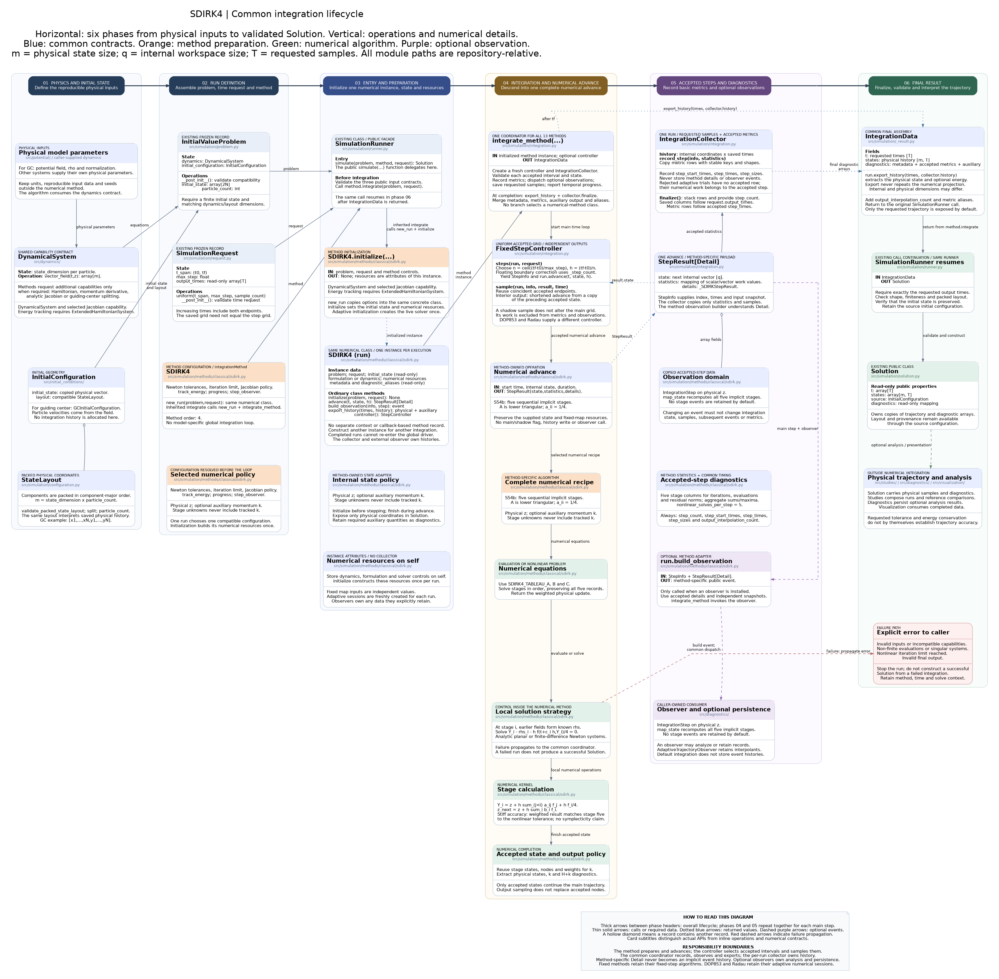

# S54b SDIRK4 simulation architecture

[Editable diagram](sdirk4-simulation-architecture.puml) · [Scalable diagram](sdirk4-simulation-architecture.svg)



The diagram retains the six-phase BM4 layout, including public contracts,
preparation, numerical equations, accepted records, optional observers and errors.

## Method instances and integration lifecycle

This method inherits `IntegrationMethod.integrate(problem, request)`, shared by
all 13 public methods. It calls `new_run(problem, request)` to create a fresh
instance of the same numerical class. That instance's `initialize` validates
capabilities and sets its formulation, initial internal state and metadata.
There is no separate context or callback-based method record.

| Operation on the numerical class | Responsibility |
|---|---|
| `initialize(problem, request)` | Initialize this run's resources once; return `None` |
| `advance(t, state, h)` | Execute numerical work and return state, statistics and typed details |
| `build_observation(info, step)` | Construct a method-specific event with independent snapshots |
| `export_history(times, history)` | Extract physical output and auxiliary diagnostics |
| `controller()` | Select fixed or adaptive accepted-step scheduling |

`integrate_method(run)` owns the common loop. Its `IntegrationCollector` saves
requested samples and copied accepted-step metric rows, without retaining
numerical details or events. The method owns the formulation and any live solver.
Analysis and persistence remain in `diagnostics/`; observers remain caller-owned.

Constructor options remain reusable through `simulate`. Per-run resources are
excluded from reconstruction, and initial state and metadata are isolated as
read-only copies. A completed or failed run cannot be integrated again; create a
fresh run. Call `new_run` for low-level access rather than resetting `initialize`.

`FixedStepController` calls `run.advance` with the exact effective duration and
uses independent shortened maps for interior output times. DOP853/Radau's
controller calls their ordinary `advance` on the live solver with an upper step
bound and reads the actual accepted endpoint. Dense sampling retains the backend.

Metric rows follow `step_times`; physical and auxiliary histories follow
`Solution.t`. Common fields are `step_count`, `step_start_times`, `step_times`,
`step_sizes` and `output_interpolation_count`. Shadow work and extra observer-only
work are excluded from accepted numerical counters.

See the [generic architecture](../../../simulation/integration-architecture.md)
for the lifecycle, adaptive semantics and extension guide. Executable contracts
are in `tests/test_method_integration.py` and `tests/test_adaptive_integration.py`.

## Public method

[`SDIRK4`](../../../../src/simulation/methods/classical/sdirk.py) is exported
from the public `simulation` package. It consumes `DynamicalSystem` directly
and has the same Newton controls and analytic/finite-difference Jacobian
selection convention as `GaussLegendre4`.

```python
from simulation import InitialValueProblem, SDIRK4, SimulationRequest, simulate

solution = simulate(
    problem,
    SDIRK4(
        newton_absolute_tolerance=1e-12,
        newton_relative_tolerance=1e-11,
        newton_max_iterations=40,
        newton_jacobian_method="analytic",
    ),
    SimulationRequest.uniform(
        t_span=(0.0, 100.0),
        max_step=0.1,
        sample_count=1001,
    ),
)
```

## Step lifecycle

The S54b tableau has five stages and common diagonal coefficient
`gamma = 1/4`. One complete step performs five sequential nonlinear solves.
At stage `i`, fields from stages `j < i` form the known right-hand side; Newton
then solves only for the current physical stage. With analytic planar
guiding-centre derivatives, the correction is vectorized across particles as
independent `2 x 2` systems. Generic dynamics use a dense centered-difference
Jacobian.

The accepted state uses the tableau weights. Because S54b is stiffly accurate,
the update is also the fifth stage to the configured nonlinear tolerance.
When `track_energy=True`, the time-conjugate momentum uses the same stage
states, nodes, and weights without enlarging the physical nonlinear systems.

## Fixed grid and observations

[`FixedStepController`](../../../../src/simulation/integration.py) keeps the main
integration grid independent of the output schedule. Main steps alone append
Newton diagnostics and notify the optional `step_observer`; shadow output
steps do neither. The generic `IntegrationStep.map_state` callback repeats the
same five-stage physical map for opt-in numerical differentiation.

## Diagnostics

The common one-dimensional arrays `nonlinear_iterations`,
`residual_evaluations`, `nonlinear_residual_norms`, and
`nonlinear_tolerances` contain one aggregate per complete step. Iterations and
evaluations are summed across the five stages; the residual norm is their
maximum. The corresponding `stage_*` arrays have shape `(step_count, 5)`.

Scalar metadata records the designed order, stage count, tableau name,
diagonal coefficient, stiff accuracy, and the deliberate absence of symmetry
and symplecticity. The exact tableau arrays are exported read-only as
`SDIRK4_TABLEAU_A`, `SDIRK4_TABLEAU_B`, and `SDIRK4_TABLEAU_C`.

## Verification

[`tests/test_sdirk4.py`](../../../../tests/test_sdirk4.py) checks all classical
order-four conditions, the failed symmetry and symplecticity identities,
observed fourth-order convergence, non-autonomous stage times, validation,
diagnostic shapes, and optional energy tracking.

[`tests/test_four_method_sdirk_comparison.py`](../../../../tests/test_four_method_sdirk_comparison.py)
checks the reusable four-method experiment contract and its aligned reference,
trajectory, energy, timing, and Newton results.
