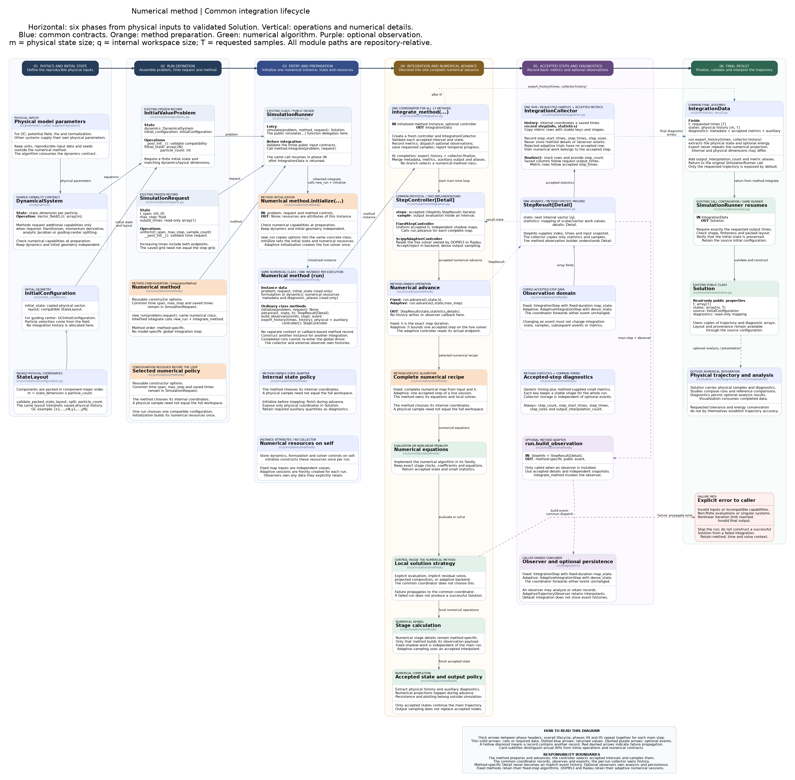

# Common numerical integration architecture

[Editable diagram](integration-architecture.puml) · [Scalable diagram](integration-architecture.svg)



All 13 public methods own their initialization, numerical advance, observation
construction and output extraction. Each integration uses a fresh instance of
its numerical class. There is no separate method context or `PreparedMethod`
record containing callbacks. The common driver calls ordinary class methods.

The diagrams retain the detailed BM4 layout: six horizontal phases and vertical
cards for inputs, operations, numerical work, observation, results and errors.

## Six phases and ownership

| Phase | Owner | Work and output |
|---|---|---|
| 1. Physical inputs | Dynamics and initial configuration | Field, parameters, units, physical state and packed layout |
| 2. Run definition | Caller | Problem, method options and temporal request |
| 3. Initialization | Numerical method | A fresh instance of the same class with its own formulation and initial internal state |
| 4. Numerical execution | Common driver, controller and method | Accepted intervals and numerical advances |
| 5. Collection and observation | Common collector; method and external observer | Saved samples, accepted metrics and optional analysis |
| 6. Result | Method exporter and runner | Physical history, auxiliary diagnostics and immutable `Solution` |

`InitialValueProblem` remains the source of physical initial data.
`SimulationRequest` owns the time span, maximum step and requested saved times.
The numerical method initializes its internal representation once. The evolving
state is explicit in `advance(t, state, h)`. Accumulated arrays belong exclusively
to `IntegrationCollector`.

## One class, a fresh instance for each run

The established public interface is unchanged:

```python
from simulation import BM4Implicit, simulate

method = BM4Implicit(newton_absolute_tolerance=1e-12)
solution = simulate(problem, method, request)
```

Internally, inherited `IntegrationMethod.integrate` performs:

```python
run = method.new_run(problem, request)
data = integrate_method(run)
```

`new_run` returns another instance of **the same class**: a BM4 run is a
`BM4Implicit`, a Radau run is a `Radau`. It copies dataclass constructor options,
then calls that instance's `initialize(problem, request)`. Runtime fields use
`field(init=False, repr=False, compare=False)`, so reconstruction excludes any
previous formulation or live solver. There is no second numerical-method type.

The configuration passed to `simulate` remains reusable. Each initialized run
belongs to one problem and one request. A finished or failed run cannot be sent
through `integrate_method` again; call `new_run` or use `simulate` again instead.
This also prevents accidental reuse of a completed adaptive solver. Ordinary
option validation runs again when creating the new instance.

| Member on the numerical class | Responsibility |
|---|---|
| `initialize(problem, request)` | Validate compatibility and set the instance's formulation, initial state and metadata; return `None` |
| `advance(t, state, h)` | Execute numerical work and return `StepResult` |
| `build_observation(info, result)` | Construct independent method-specific snapshots when an observer is configured |
| `export_history(times, history)` | Extract physical samples and auxiliary diagnostics |
| `controller()` | Select fixed scheduling or the method's adaptive controller |
| `initial_state`, `metadata`, `diagnostic_aliases` | Read-only copies finalized by `new_run` |
| `problem`, `request` | Inputs associated with this run |
| `step_observer`, `progress`, `method_name` | Execution options and label |

Use `new_run` for low-level access. `initialize` is the implementation hook called
by that factory, not a public way to reset an existing run. Fixed-map evaluations
can use independent candidate states; adaptive advances must start from the live
solver's current state. A partially advanced adaptive run is not resumable through
the full-interval common driver.

Mathematical helper functions remain separate when they express a useful kernel:
BM4's projected solve, collocation stage solves and ABBA's projection equations.
A prepared *formulation* such as `PreparedDirectAdjointFormulation` is a numerical
resource stored on the method; it is not another method or integration coordinator.
Classical methods need only their dynamics and stage data, without an artificial
formulation wrapper.

## Common driver and records

```text
simulate(problem, method, request)
  SimulationRunner
    IntegrationMethod.integrate
      method.new_run(problem, request)
        copy constructor options into the same numerical class
        run.initialize(problem, request)
        isolate initial state and metadata
      integrate_method(run)
        run.controller() + new IntegrationCollector
        for each accepted (StepInfo, StepResult):
          validate interval and state
          collector.record_step(info, result.statistics)
          optional run.build_observation -> observer
          controller.sample -> save requested output columns
          update progress from accepted time
        run.export_history(times, collector.history)
        collector.finalize + metadata + auxiliary + aliases
        return IntegrationData
    validate physical samples and construct Solution
```

`StepResult[Detail]` contains `state`, `statistics` and method-specific `details`.
`Detail` links a method's advance to its observation builder; examples include
`_ProjectedBM4Step`, `_GaussStepResult`, ABBA projection traces and adaptive dense
output. It is a typing relationship, not another runtime layer. The collector
copies only saved states and metric rows, never details or observer events.
`StepInfo` records the accepted index, interval and independent input snapshot.

The method exposes cheap work counters independently of detailed observations.
It builds events only when requested. The external observer performs analysis or
persistence; its lifecycle remains with the caller. Reusing a stateful observer
across simulations requires an explicit caller-managed policy.

## Fixed and adaptive control

| Property | Fixed methods | DOP853 and Radau |
|---|---|---|
| Controller | `FixedStepController` | `ScipyAdaptiveController` |
| Main grid | Uniform effective duration | Backend-selected accepted intervals |
| `advance(t, state, h)` | Evaluate an independent map of duration `h` | Advance the instance's live solver, with `h` as an upper bound |
| Actual endpoint | `t + h` | `run.solver.t` after acceptance |
| Trial rejection | Not provided by these methods | Internal to the SciPy solver |
| Interior output | Independent shortened shadow map | Accepted dense interpolant |
| Retained numerical memory | Method resources; local work per evaluation | Solver state, stages and Jacobian/factorization reuse |
| Observation | `IntegrationStep` subclass with candidate-state map | `AdaptiveIntegrationStep` with dense output |

Both controllers call the numerical class's `advance`. DOP853/Radau initialization
creates one live solver owned by that run. Successive advances retain it; the
controller reports its actual accepted endpoint. An advance does not recreate the
backend or integrate an arbitrary independent interval. The old private
independent-interval helper has been removed from this internal contract.

Output times do not prescribe adaptive boundaries. Dense sampling neither
restarts nor advances the solver. Fixed shadow calculations do not change main
states, accepted metrics or observations. The common contract does not add an
error estimator to BM4, ABBA or other fixed methods.

Adaptive controls are `relative_tolerance`, `absolute_tolerance`, `first_step`
and `dense_output`; Radau also accepts a full-state `jacobian`. Optional energy
tracking augments the error-controlled state and can change the accepted grid.

## Data and numerical conventions

`IntegrationCollector.history` has shape `(internal_size, saved_times)`;
`Solution.states` has shape `(physical_size, saved_times)`. Metric arrays have one
row per accepted step, which need not equal the number of saved samples:

- `step_start_times`, `step_times`, `step_sizes`: accepted intervals;
- `step_count`: number of accepted intervals;
- `output_interpolation_count`: strictly interior output evaluations.

ABBA4 has one projection per complete step, Gauss has two collocation stages,
SDIRK4 has five stage solves and ABBA6 has seven projections. These count different
objects. Explicit methods do not acquire nonlinear-work counters.

DOP853/Radau report function evaluations, Jacobian evaluations and LU decompositions.
The first accepted row includes initialization; rejected trials belong to the
following acceptance. Extra interpolation work needed only by an observer is
excluded, while `dense_output=True` includes it at every accepted step.
`AdaptiveTrajectoryObserver` can retain interpolants for later queries; default
collection stores no continuous-trajectory history.

Projection belongs to numerical advance, not output extraction. Energy conventions
remain local: ABBA physical tracking uses `kappa=k/2`; classical/adaptive augmented
tracking uses the corresponding `H+k`; HBVM42 reports physical Hamiltonian drift.
ABBA4 retains its single outer projection around three unprojected factors.

## Reading and extending the implementation

Start with the numerical class's fields, `initialize`, `advance`,
`build_observation` and `export_history`. For ABBA2/4/6, these operations are
inherited from `_ABBAImplicitMethod` in `abba/_implicit.py`; concrete classes
select order and supported placement. DOP853/Radau share `_AdaptiveMethod`.
The [method catalog](../models/README.md) links every theory and six-phase diagram.

To add a method, define a dataclass subclass of `IntegrationMethod[Detail]`, put
its per-run resources in fields excluded from the constructor, and implement the
operations above. Use fixed control by default, or provide a controller that
reports actual adaptive acceptances and samples their dense output. Keep the
global loop and collection shared.

Tests in `tests/test_method_integration.py` and `tests/test_adaptive_integration.py`
cover run isolation, repeatable public simulations, completed-run rejection,
observation snapshots, sampling and backend equivalence. The 224 fixed-method
regression cases preserve trajectories, diagnostics, events and retained maps
exactly. These short checks validate implementation equivalence; scientific
trajectory accuracy still requires refinement and independent reference audits.
