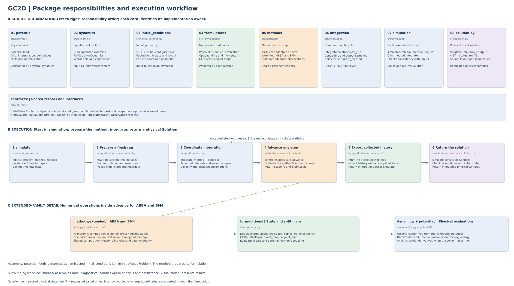

# Integration and the four state formulations

All 13 public methods use `IntegrationMethod.new_run` and `integrate_method`.
Dynamics defines physics; formulation defines coordinates; method defines one
numerical step; integration controls accepted intervals and collects output.

The source packages follow that ownership: `src/contracts/` holds the shared
problem, request, state-layout, step and observation types;
`src/formulations/` defines physical and doubled state representations;
`src/methods/` implements numerical steps; and `src/integration/` controls
accepted steps and output collection. `src/simulation/runner.py` validates the
assembled run and returns the immutable `src/solution.py` result. Concrete
initial geometry stays in `src/initial_conditions/`. The `simulation` package
continues to export the established public names through explicit imports and
`__all__`. Internal consumers import directly from the defining modules.

Validation follows the same ownership: `InitialValueProblem` checks the dynamics
protocol and compatible initial layout; state formulations check the Hamiltonian
capability needed for energy tracking; method constructors check their numerical
options. Methods reuse these validated inputs instead of repeating the same
capability checks. `IntegrationMethod.new_run` owns immutable run snapshots.

Long validation blocks are organized as private preparation functions within
their owning modules. `SimulationRequest` separates interval validation from
output-schedule normalization, and reuses the interval rule in `uniform`.
`Solution` prepares the physical history and immutable diagnostics separately;
the runner retains responsibility for agreement with the requested initial state
and saved times. Run preparation similarly separates initial-state ownership
and metadata freezing from the method lifecycle.

Scalar option rules shared by numerical families live in `methods._validation`.
Callers retain their existing conversion policies, including whether Boolean
values are rejected before conversion to floating point. Newton and Broyden
separate validated entry data from their iterations and reuse residual checks
without repeating a cached evaluation. Checks on convergence, singular systems,
accepted-step continuity, and newly computed non-finite values remain next to
the numerical operation that produces them. No public names or signatures are
changed by these internal boundaries.

The downstream packages follow the same ownership convention. Studies share
scalar and sampling rules in `studies._validation` and aligned comparison
records in `studies._comparison_validation`; scientific identity, exact versus
tolerant time alignment, and method-specific diagnostics remain local to each
study family. Diagnostics prepare typed observation records before analysis and
keep sequence and sampling checks at their original state transitions. File
readers retain their format-specific integrity checks. Visualization prepares
validated series before creating figures and shares planar-solution and
animation controls through private package modules, preserving each animator's
frame-count policy. The separately packaged Poincare batch runtime keeps its
validation helpers within the files shipped to workers.

## Package workflow diagram



Open the [SVG](package-workflow-architecture.svg),
[PNG](package-workflow-architecture.png), or
[PlantUML/Graphviz source](package-workflow-architecture.puml).
The previous detailed integration lifecycle is preserved as
[`integration-architecture_old.puml`](integration-architecture_old.puml),
with its [SVG](integration-architecture_old.svg) and
[PNG](integration-architecture_old.png) renderings.

The upper row follows the source responsibility order:
`potential -> dynamics -> initial_conditions -> formulations -> methods -> integration -> simulation -> solution`.
These are responsibility headings, not successive runtime calls. In particular:

- `potential` supplies the physical field consumed by `dynamics`.
- `dynamics` and `initial_conditions` are independent inputs to
  `contracts.problem.InitialValueProblem`.
- Each method prepares its formulation during initialization. Formulations
  define internal coordinates, physical extraction and applicable split maps.
- `simulation.runner.simulate` delegates a complete problem, method and request
  to `Execution.run`, which executes locally by default. The method's inherited
  `integrate` prepares a fresh run and invokes
  the common integration coordinator. Its controller calls `advance` repeatedly;
  the coordinator requests output samples from the controller and collects the results.
- History export returns `IntegrationData` to `simulate`, which constructs and
  validates the final `Solution`. Its implementation is `src/solution.py`.

The shared `contracts/` band identifies the data exchanged across these owners.
The lower detail follows ABBA/BM4 composition through `direct_map` and
`adjoint_map` to the physical dynamics. Other numerical families share the same
execution lifecycle with their own step algorithms.

The diagram's content and layout are maintained in
`scripts/render_package_workflow.py`. Regenerate all three formats together:

```bash
MPLCONFIGDIR=/tmp/gc2d-mpl .venv/bin/python scripts/render_package_workflow.py
```

## Public API and imports

Use `from simulation import ABBA4Implicit, BM4Implicit, simulate` for the public
execution API. `methods`, `methods.extended`, `formulations`, and `integration`
also declare their supported exports explicitly. `contracts` exposes types from
its individual submodules; its package initializer deliberately exports no names.
Every exported class or function has one implementation; public re-exports refer
to that same object. Internal modules do not import through the `simulation`
facade. Studies call `simulation.runner.simulate` directly.

The following old routes have been removed after migrating supported consumers:

| Removed route | Current owner |
|---|---|
| `contracts.execution.Execution` | `execution.Execution` for the executor; `contracts.execution_options.ExecutionOptions` for backend choices |
| `simulation.methods.*` | `methods.*` |
| `simulation.formulations.*` | `formulations.*` |
| `simulation.integration`, `simulation._fixed` | `integration.core`, `integration._fixed` |
| `simulation.configuration`, `.problem`, `.request`, `.observation` | Corresponding `contracts` submodules |
| `simulation._result` | `contracts.result` |
| `simulation.solution` | `solution` |
| `methods.abba.*`, `methods.bm4.*` | `methods.extended` public exports and their defining modules |
| `methods._abba_coefficients` | `methods.extended.core.composition` |
| Full time/momentum projection modules | Removed; use spatial projection with `track_energy=True` for new studies |
| `methods.extended.order4_implicit_single_projection` | `methods.extended.abba.ABBA4Implicit`; shared projection in `methods.extended.core.projection` |

No import hooks or `sys.modules` aliases recreate those paths. Deprecated
execution classes, method factories, and full-projection studies have also been
removed; see the [API migration guide](api-migration.md).
`tests/test_package_layout.py` checks the package boundaries and declared exports.

## Execution and state ownership

The `simulate` function owns the stateless simulation entry point and delegates
each complete integration to an `execution.execution.Execution` instance.
The local executor calls `method.integrate`; subclasses can replace the whole
execution without moving numerical algorithms out of their existing packages.
See the [executor contract](execution.md). `Solution` validates and
copies the physical arrays, including their dimensions, finite values and
packed layout. The entry point then checks that the saved times, state size and
initial state agree with the request and problem. Each check has one owner.

`simulate(..., options=ExecutionOptions(...))` optionally selects JAX for every
built-in method. The inherited entry point binds the execution choice before
initializing a fresh run. Fixed methods use a common device driver for the time
loop, stages and nonlinear solves; DOP853/Radau retain SciPy control and use
compiled field/energy batches. Both return the usual NumPy `Solution`. Omission
preserves the default CPU controller shown above. See the
[JAX execution contract](jax-execution.md) for the exact scope and limitations.

Gauss--Legendre and SDIRK share field validation, analytic particle Jacobians,
centered finite differences and Jacobian selection in
`src/methods/classical/_jacobians.py`. Their stage equations and nonlinear solves
remain defined by each method. GC and FC split maps share the optional momentum
update in `src/formulations/base.py`.

| Formulation | One planar particle | N planar particles |
|---|---:|---:|
| Physical | 2 | 2N |
| Physical with energy | 4 | 4N |
| Spatially duplicated | 4 | 4N |
| Spatially duplicated with energy | 6 | 6N |

Use `track_energy=True` on any public method. Classical methods use
`PhysicalFormulation`; ABBA and BM4 use `DoubledFormulation`. These concrete
objects live in `src/formulations/state.py`. Energy variants append one
time entry and one normalized momentum per particle. Projected methods
store diagonal accepted copies and project spatial variables only. Every
component block has N entries, and `components(state)` exposes a uniform
`(coordinates, N, *sample_axes)` view. The time entries repeat the scalar
integration time. `extended_time` has shape `(N, saved_times)`; `Solution.t`
remains the one-dimensional grid.

`StepResult` and `StepInfo` live in `src/contracts/step.py`. Their states are
internal; `Solution.states` and observer states are physical.
`StepResult.statistics` contains accepted physical work. Details are transient
unless an observer explicitly retains a copied event. `export_history` delegates
to the formulation's common physical and energy extraction.

Tracking does not affect physical stages, Newton/Broyden scales or adaptive error
control. DOP853 and Radau own physical-only SciPy solvers and use eight-point
Gauss quadrature over accepted dense output for passive momentum. This quadrature
has no independent error tolerance; audit it by refinement. Radau's optional
Jacobian always differentiates physical coordinates only. Diagnostic interpolation
work and energy-derivative evaluations are excluded from physical work counters.
BM4 reuses the converged residual's shear states for passive quadrature without
repeating spatial maps. Adaptive energy samples reuse their accepted interval's
endpoint momenta; only interior queries require partial-interval quadrature.

Fixed controllers reuse accepted endpoint states and compute off-grid samples with
independent shortened maps; adaptive controllers evaluate accepted dense output.
The formulation validates each
particle time and aligns diagnostic times to the requested grid within round-off.
The coordinator and collector do not inspect clock indices or tracking flags.
Observer snapshots cannot mutate
samples or counters. Repeated runs own fresh solver resources.

The former `fully_extended` selector is rejected. It described spatial, time and
momentum projection in eight duplicated coordinates and is not an energy-monitoring
option. Existing historical full-state diagnostics are readers of that former
record type, not an active simulation path. Canonical model guides and theory
PDFs document the current methods; older rendered diagrams are historical.

## Comparison and archive record ownership

The three-, four-, and five-method studies share numerical setup, method
construction, aligned-result validation, and metric reductions through
`studies._comparison`. Their public configuration and result classes remain
available from their existing study modules and the `studies` facade. The family
configurations and results are siblings of neutral common bases; adding a method
does not make one campaign depend on another campaign's private functions. The
three- and four-method runners retain their alternating timing order. The
five-method runner retains reference reuse, optional parallel model campaigns,
and completion logging.

`contracts.comparison` owns immutable reference and accuracy series, execution
records, and comparison summary records. `ComparisonReadView` describes the
shared read interface of live five-method results and loaded CSV views. CSV
loading constructs these concrete records rather than mutable attribute bags;
the existing CSV schema, public loader, and public study imports are preserved.
New numerical consumers read the canonical `residual_evaluations` complete-step
series.

`contracts.study_results` owns `GCEnergyBoundResult`,
`ParallelBM4RecurrenceConfig`, and `ParallelBM4RecurrenceResult`. The existing
study modules explicitly re-export these classes. Their HDF5/NPZ loaders and
visualizers import the record owners directly, so reading an archive does not
import study orchestration or execute a simulation. Existing energy and parallel
recurrence archive schemas are unchanged. Scalar configuration rules shared with
those records live in `contracts._study_validation`; study-specific geometry,
reference identity, and execution policies remain in `studies`.
