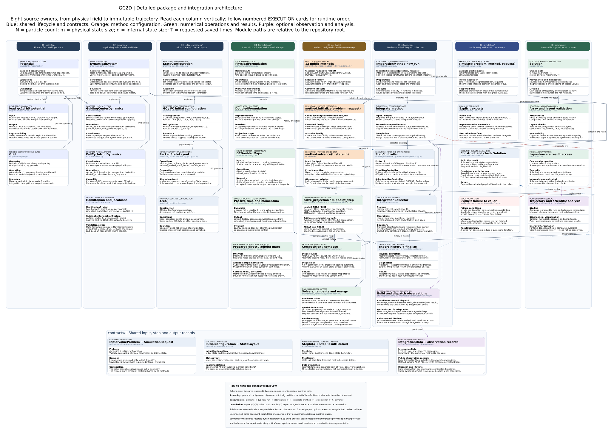

# Detailed package and integration architecture



Open the scalable [SVG](package-integration-architecture.svg), the
[PNG](package-integration-architecture.png), or the canonical
[PlantUML/Graphviz source](package-integration-architecture.puml).
The diagram is intended to be viewed at full size or with zoom.

This additional view uses the column layout, colored card headers, API details
and section dividers of the [archived lifecycle](integration-architecture_old.puml).
The archived diagram and the [compact package overview](package-workflow-architecture.svg)
remain available unchanged.

## Reading the diagram

The eight columns follow the source organization: `potential/`, `dynamics/`,
`initial_conditions/`, `formulations/`, `methods/`, `integration/`, `simulation/`,
and the `solution.py` module. Each card identifies its implementation owner and
describes inputs, operations, outputs or invariants. Column order describes
responsibilities; the numbered **EXECUTION** cards identify runtime order.

The `contracts/` band contains shared problem, request, layout, step, result and
observation interfaces. Physical capability protocols belong to
`dynamics/protocols.py`, split-map protocols to `formulations/base.py`, and the
public method protocol to `methods/base.py`.

Solid arrows show selected calls or required data. Dotted blue arrows show
returns; dashed purple arrows show optional observations or analysis; red dashed
arrows show error propagation. Cards without connecting arrows document ownership
and capabilities rather than extra execution stages.

## Runtime sequence

1. The caller assembles the potential, dynamics and initial configuration.
   `InitialValueProblem` combines dynamics with initial geometry and validates
   their compatibility. The caller also selects a method and `SimulationRequest`.
2. `simulate` validates the public input contracts and calls `method.integrate`.
   The inherited implementation creates a fresh instance through `new_run`,
   calls the concrete method's `initialize`, and freezes its prepared snapshots.
3. `integrate_method` selects the controller and creates a collector. The
   controller calls `advance` for each accepted interval. The coordinator
   validates returned states, records statistics, dispatches optional observations
   and saves the requested samples.
4. Fixed controllers use a uniform effective step and independent shortened maps
   for interior output samples. Adaptive controllers keep a live SciPy session
   and evaluate its accepted dense output. Accepted steps and saved times are
   separate grids.
5. At completion, `export_history` delegates to the state formulation. Physical
   states and auxiliary diagnostics are combined with metadata and accepted-step
   metrics into `IntegrationData`.
6. The original `simulate` call resumes, constructs `Solution`, and checks its
   saved times and initial physical state against the inputs. `Solution` owns
   structural validation and copied, read-only output arrays.

## Extended-family detail

ABBA and BM4 use `DoubledFormulation` for accepted state and output extraction,
and `GCDoubledMaps` for spatial `direct_map` and `adjoint_map` operations. Their
shared composition engine traverses signed palindromic recipes: 2 stages for
ABBA2, 6 for ABBA4, 14 for ABBA6, and 12 for BM4.

The implicit methods apply one outer Hairer projection around the complete
recipe. ABBA4 and ABBA6 share this execution structure; their intermediate ABBA
pairs are unprojected. Midpoint variants apply one arithmetic average after the
composition. Newton/Broyden support, analytic tangents and passive energy
quadrature reuse the shared numerical implementation and accepted stage data.

For planar guiding-center particles, physical formulations use `2N` coordinates
or `4N` with energy tracking; doubled formulations use `4N` or `6N`, respectively.
Only spatial variables enter the projection. Public result states remain
physical, while auxiliary time, momentum and energy values are diagnostics.

For method-specific details, see the
[extended-family architecture](../models/extended/simulation/extended-simulation-architecture.md)
and the [integration and state-formulation guide](integration-architecture.md).

## Regeneration

Edit `package-integration-architecture.puml`; it is the canonical source.
Its `@startdot` block is supported by PlantUML with Graphviz. The repository
renderer uses the WebAssembly Graphviz package `@viz-js/viz` and the SVG rasterizer
`sharp`, so a system Graphviz executable is optional.

With Node.js and these packages available through normal module resolution or
`NODE_PATH`, run from the repository root:

```bash
node scripts/render_detailed_architecture.cjs
```

The renderer creates the matching SVG and PNG from that single source. It writes
only `package-integration-architecture.svg` and `.png`; the compact and archived
diagrams have independent sources and renderings.
